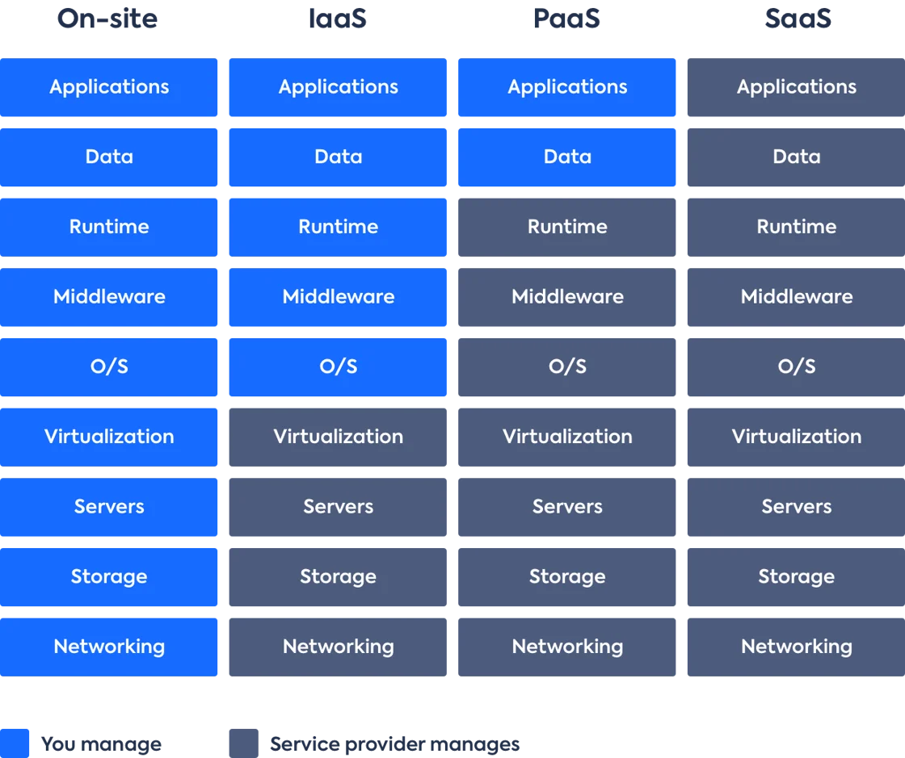

# Delivery Manager and DevOps on a Salesforce Project

## Salesforce
Salesforce is a SaaS (Software as a Service) solution. It provides a comprehensive suite of cloud-based applications designed to help businesses manage customer relationships, sales, and marketing more efficiently. As a SaaS platform, Salesforce offers a scalable and flexible solution that can be accessed from anywhere with an internet connection, eliminating the need for local installation and maintenance. This model allows businesses of all sizes to utilize advanced technology and infrastructure without significant upfront investment. Salesforce's services are continuously updated, ensuring that users have access to the latest features and security enhancements.

## Delivery Manager and DevOps Specialist

Salesforce is a SaaS solution, and due to its nature, on smaller projects, the roles of Release Managers, DevOps specialists, or Delivery Managers may be merged to optimize resources and simplify processes. When an effective and resilient CI/CD infrastructure is established, combining these roles can lead to increased operational efficiency and project management effectiveness.

### Key Advantages of Role Consolidation

Merging the roles of Delivery Manager and DevOps into a single position or department can bring significant benefits:
- **Resource Optimization**: A single person overseeing both delivery and deployment processes can streamline communication and decision-making, reducing delays between teams.
- **Enhanced Responsiveness**: With one person responsible for end-to-end processes, quicker adaptations to changes in requirements or project scope can be achieved, improving agility.
- **Integrated Management**: Combining roles helps in aligning project delivery with technical processes, ensuring smoother handoffs and better alignment with business objectives.

Both roles focus on ensuring the **efficiency**, **reliability**, **predictability**, **scalability**, and **flexibility** of project delivery processes. They are able to assess which tools and methodologies best suit a project based on its size, goals, and level of maturity. A consolidated approach allows for restructuring and adjusting processes more effectively as the business grows or changes.

### Potential Risks of Merging Roles

However, despite the clear benefits, merging the Delivery Manager and DevOps roles also carries certain risks:
- **Overburdening Individuals**: One person may struggle to balance the strategic and operational demands of both roles, leading to burnout or a drop in performance quality.
- **Knowledge Gaps**: While Delivery Managers are often skilled in project management, they may lack the deep technical expertise required for complex DevOps tasks, or vice versa. This can lead to inefficiencies or errors in critical areas.
- **Conflicts in Priorities**: Project management and technical implementation often have different priorities. Delivery Managers may focus on meeting deadlines and aligning with business goals, while DevOps emphasizes stability, scalability, and the quality of technical execution. Balancing these conflicting priorities can complicate decision-making, potentially leading to delays or suboptimal solutions.

In summary, merging the roles of Delivery Manager and DevOps Specialist can be a viable solution for small projects or organizations with robust CI/CD infrastructure. However, careful consideration of the potential risks is essential to avoid inefficiencies and ensure the long-term success of project delivery.

## Service Delivery Manager vs Delivery Manager
The Service Delivery Manager differs from the Delivery Manager in that the Delivery Manager on the project is responsible for the successful completion and delivery of the project, managing the team and resources. The Service Delivery Manager focuses on managing the quality and timely delivery of IT services, interacting with clients, and maintaining SLAs (Service Level Agreements).
Delivery Manager - focuses on the project.
Service Delivery Manager - focuses on long-term service and customer relationships.

## About This Section of the Hub
The description of roles is divided into separate sections:
- [Role: DevOps Specialist](01_01_DevOps/index.md)
- [Role: Delivery Manager](01_02_Delivery_Manager/index.md)

The **Management section** is combined to simplify navigation and so that each company and project can independently define the necessary areas of influence for specialists.
