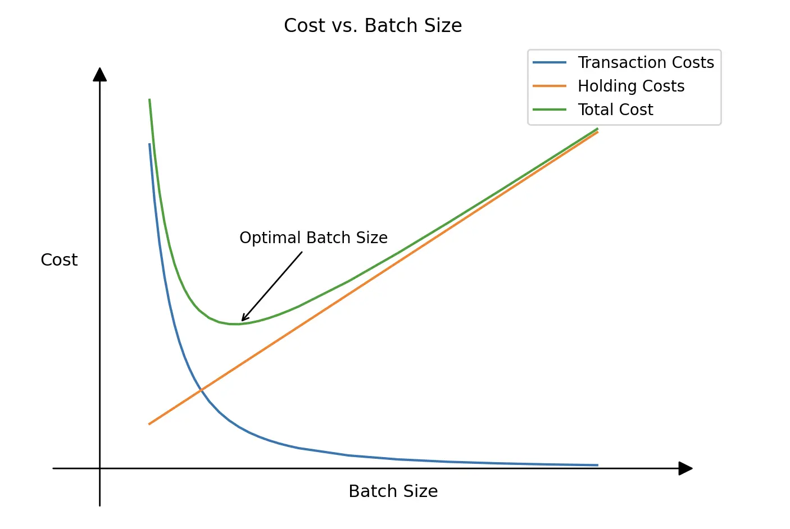

In modern change management, whether delivering new features or updates, the concept of **Batch Size** plays a crucial role. Batch Size is one of the key factors affecting the efficiency of the development and delivery process. It is essential to understand that Batch Size influences not only the speed of change delivery but also system stability and the overall costs incurred by a company.

## What is Batch Size in Release Management?

Batch Size in the context of releases refers to the number of changes (new features, bug fixes, improvements) included in a single release or the volume of changes that simultaneously go through all process stages—from development to production deployment. This can range from a small set of individual changes to large-scale releases containing multiple features.

### Example:
- **Small Batch Size**: Frequent small updates, such as daily or weekly releases.
- **Large Batch Size**: Infrequent major releases containing dozens of changes, often launched once every few months.

## Transaction Costs and Holding Costs
### Transaction Costs
**Transaction Costs** refer to the expenses incurred in transferring, integrating, and coordinating changes. These costs stem from the need for alignment, testing, communication, and release management.

#### How Transaction Costs Manifest:
- **Larger batch sizes increase transaction costs** – If the Batch Size is small, the team must communicate, test, and release changes more frequently.
- **High coordination overhead** – Teams spend more time on discussions, integration testing, and version control.
- **Change Enablement complexity** – Each release must go through risk assessment and change approval processes.
- **Increased DevOps and CI/CD workload** – Frequent releases demand automated deployment and testing processes.

### Holding Costs
**Holding Costs** refer to the costs associated with delays in delivering changes to production. The longer a team holds back developed features, the higher the cost of these delays.

#### How Holding Costs Manifest:
- **Extended delivery cycles reduce business profitability** – If a new feature is delayed, users cannot use it, and the company loses potential revenue.
- **Requirement obsolescence** – The longer changes remain in development, the higher the risk that they become outdated.
- **Slower feedback loops** – If a product is not updated regularly, the team struggles to gather feedback and adapt to the market.

The graph below illustrates the relationship between Transaction Costs and Holding Costs with Batch Size. The optimal point is where total costs (Total Cost) are minimized.

## Project Parameters and Their Relationship with Batch Size

| **Parameter**                       | **Large Batch Size**                                                                        | **Small Batch Size**                                                                                |
| ----------------------------------- | ------------------------------------------------------------------------------------------- | --------------------------------------------------------------------------------------------------- |
| **Coordination Overhead**           | Lower overhead, as teams spend less time on discussions and integration.                    | Higher overhead due to more synchronization, coordination, and task management.                     |
| **Number of Releases & Tests**      | Fewer releases reduce the overall testing and deployment load.                              | Frequent releases increase testing and deployment effort but allow faster delivery of improvements. |
| **Infrastructure Change Frequency** | Lower frequency of changes simplifies IT asset management and reduces failure risks.        | Frequent changes may lead to instability and increased operational risks.                           |
| **Testing and Rollback Complexity** | More complex testing and rollback: defects are harder to detect due to larger code changes. | Easier testing and rollback: small changes are simpler to analyze and fix.                          |
| **Deployment Workload**             | High deployment workload: large releases require more time and resources for deployment.    | Low deployment workload: frequent small releases are faster and require fewer resources.            |
| **User Feedback Speed**             | Slow feedback: infrequent releases make it harder to adapt to user and business needs.      | Fast feedback from users allows quick product adjustments.                                          |
| **System Stability**                | More stable system since changes are made less frequently and undergo more testing.         | Stability may suffer as frequent changes increase the risk of production failures.                  |
| **Automation Workload**             | Lower automation workload, as release and testing processes occur less often.               | High automation workload: advanced CI/CD is required to ensure efficient releases.                  |

## Why the Optimal Batch Size is Not Always Small
A small Batch Size has its advantages, but it is not always the best choice. In some situations, larger batches are preferable:
- If transaction costs per release are high, consolidating changes into one batch may be more cost-effective.
- For large-scale changes requiring comprehensive testing, the Batch Size should be sufficient to minimize dependency risks.
- Large releases may be preferable when updates involve significant changes that are best introduced simultaneously.

A small Batch Size can increase costs for testing, reliability assurance, and security. Frequent releases may also place additional pressure on developers, reducing the time available for refactoring and increasing the risk of technical debt.

Moreover, overly frequent updates may frustrate users and disrupt business processes.

The key principle is to **find a balance between risks, costs, and user expectations**.

## How to Determine the Optimal Batch Size?
To identify the optimal batch size for change releases, consider the following approaches:
1. **Assess the Need for a Fast Feedback Loop**
    - The faster you receive feedback, the quicker you can adjust the product. If **fast feedback is critical (SaaS, startups, e-commerce)**, reducing Batch Size and increasing release frequency is essential. If **feedback is less critical, but the cost of failure is high (banking systems, aviation, healthcare)**, a larger Batch Size is more rational to ensure thorough testing.

2. **Evaluate Holding Costs and Transaction Costs**
    - Use metrics like:
        - **Lead Time** (Time from task creation to release)
        - **Cycle Time** (Time spent actively developing a task)
        - **Deployment Frequency** (How often releases are deployed to production)
        - **Change Failure Rate** (The proportion of failed changes in the production environment)

3. **Categorize Changes (ITIL 4)**
    - Classify changes as standard, normal, or emergency:
        - **Standard changes** - Small Batch Size
        - **Normal changes** - Flexible Batch Size
        - **Emergency changes** - Minimal Batch Size

4. **Evaluate the Maturity of DevOps Processes** <!-- TODO: add link to Maturity Matrix-->
    - The maturity of DevOps processes plays a key role in determining the optimal Batch Size. The higher the level of automation and process integration, the smaller the Batch Size can be without increasing transaction costs.
    - **Low DevOps maturity** - Larger Batch Size, infrequent releases (as each release requires significant time and coordination).
    - **High DevOps maturity** - Smaller Batch Size, frequent releases (minimizing costs for testing, delivery, and increasing reliability).

5. **Gradual Experimentation is Necessary**    
    - Start with a small Batch Size and gradually increase it, observing changes in metrics: number of errors, delivery time, user feedback.

6. **Evaluate Delivery Architecture Complexity**    
    - If the architecture is complex and many changes are interdependent, it may be best to include them in a single batch to avoid conflicts and minimize dependency-related errors.

7. **Regularly Analyze Metrics**
    - Use past release data to understand how Batch Size impacts delivery speed, quality, and stakeholder satisfaction.

## Conclusion
The optimal Batch Size is not always the smallest possible size. It is determined by a balance between release frequency, transaction costs, and risks. Regular analysis, automation, and flexibility are key elements of a successful Batch Size management strategy.
