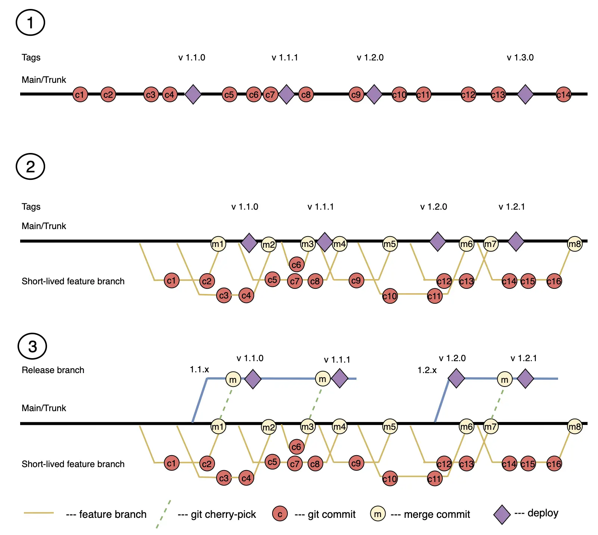

The Trunk-Based Development (TBD) strategy is applied in projects where the main values are release frequency and speed. It is characterized by frequent commits and merges into a single main branch. If feature branches are used, they exist for no longer than a few days or hours. Under this strategy, the main branch is always ready for deployment to production, although release branches may also be used. This approach is more often used in small teams due to the need for close interaction and good communication among developers, clear process organization, and discipline.

### Implementation Examples
The strategy can use feature branches and release branches, but the key feature is a single main branch.
The example shows implementation scenarios:
1 - without using additional branches
2 - with feature branches
3 - with feature branches and release branches

### Advantages

1. **Rapid Issue Identification and Resolution**: Frequent commits and configured automation allow for quick detection and resolution of issues, especially integration problems.
    
2. **Simplified Branch Management**: The absence of long-lived branches can simplify the code management process, reducing the likelihood of conflicts and merge errors.
    
3. **Improved Code Quality**: TBD is accompanied by the automation of CI/CD processes, including testing, which helps maintain a high standard of code quality since each change is automatically verified.
    
4. **Faster Feature Delivery**: Frequent releases allow for faster delivery of new features to users, improving time to market and customer satisfaction.
    
5. **Constant Deployment Readiness**: The main branch is always in a state ready for production deployment, which simplifies and speeds up the release process.
    
6. **Better Team Interaction**: The requirement for frequent commits and merges encourages the team to engage in more active interaction and coordination, improving teamwork.
    
7. **Enhanced Transparency**: All changes occur in one branch, making the development process more transparent and accessible to all team members.
    
### Disadvantages

1. **Scalability Issues**: In large teams with many developers, frequent commits to one branch can lead to numerous conflicts and merge complexities.

2. **Discipline and Process Requirements**: Successful TBD implementation requires high team discipline, well-organized processes, and a culture of continuous integration, which is not always easy to achieve.

3. **High Automation Demands**: A good CI/CD system for automatic testing and deployment requires significant resources and time for setup and maintenance.

4. **Risk of Reduced Code Quality**: Fast and frequent integrations can lead to the inclusion of insufficiently tested or low-quality code if the review and testing processes are not strict enough.

5. **Potential Performance Issues**: Frequent merges can increase the load on the version control system and CI/CD infrastructure, potentially slowing down the integration and deployment process.

6. **Limited Experimentation Opportunities**: The absence of long-lived branches can limit opportunities for long-term experiments and major changes that require more time for development and testing.

7. **Complex Testing**: Feature flags are used to ensure that unfinished code does not interfere with the deployment of the main branch, which adds additional testing workload for different system configurations.

### Features 

**Feature Flags**
This development technique allows enabling or disabling features in an application without deploying new code. This is achieved by using conditional statements that check the flag's state and enable or disable the corresponding functionality.

### Ideal Project Profile

1. **Small to Medium Development Team**: With a small number of developers, it is easier to coordinate frequent commits and integrations, reducing the risk of conflicts and simplifying branch management.
    
2. **High Level of Automation**: A reliable and well-configured continuous integration and deployment (CI/CD) system that automatically performs tests, checks, and deployments is critical for the success of TBD.
    
3. **Culture of Code Quality**: The team should adhere to high standards of code quality, regularly conduct code reviews, and ensure thorough testing before committing to the main branch.
    
4. **Effective Interaction and Communication**: The team should have well-established communication and interaction processes to quickly address issues and coordinate their actions.
    
5. **Short-Term Tasks**: Projects should be broken down into small, manageable tasks that can be completed within a few days or even hours to support frequent commits and integrations.
    
6. **Flexibility and Adaptability**: The development process should be flexible and able to quickly adapt to changing requirements and conditions, helping to respond promptly to feedback and make necessary adjustments.
    
7. **Version Control and Monitoring Tools**: Use of modern version control tools such as Git, as well as monitoring and performance analysis tools for timely issue detection and resolution.
    
8. **Management Support**: Leadership should support the implementation of TBD by providing the necessary resources and creating conditions for the team's effective work.

