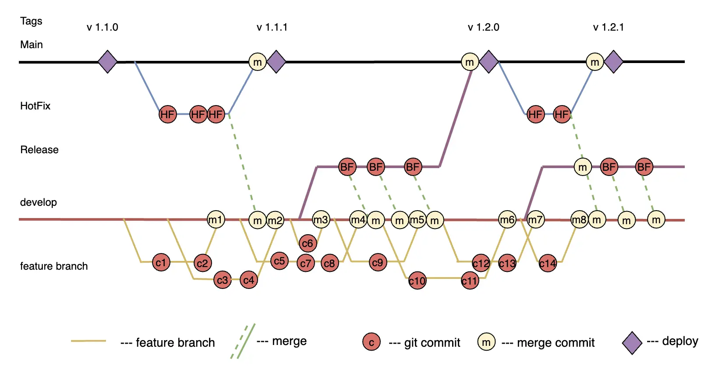

Git Flow is a popular branching strategy in Git, developed by Vincent Driessen [link](https://nvie.com/posts/a-successful-git-branching-model), for a structured development process. The main branches are `main` for production code and `develop` for integrating new features. Feature branches are created from `develop` and merged back after completion. Release branches prepare releases, merging into both `main` and `develop`. Hotfix branches are for urgent production code fixes and also merge into both main branches. This strategy supports parallel development, simplifies large project management, and minimizes conflicts.

### Implementation Examples
The most popular scheme for the Git Flow strategy is illustrated below.

### Advantages

1. **Clear Structure**: Git Flow provides a clear and organized branching structure, making development management easier in large teams and complex projects.
   
2. **Parallel Development**: Developers can work on different features simultaneously without conflicts by using feature branches.

3. **Simplified Release Cycle**: Release branches allow thorough testing and preparation of releases, including the latest fixes and metadata, before deploying to production.

4. **Effective Hotfix Management**: Hotfix branches provide a quick way to fix critical production errors without disrupting the current development cycle.

5. **Code Consistency**: Back merging hotfix and release branches into the `develop` branch maintains code consistency.

6. **CI/CD Support**: The strategy integrates well with continuous integration and deployment practices, ensuring automated testing and deployment.

### Disadvantages

1. **Complexity**: For small teams and projects with frequent releases, Git Flow can be overly complex and redundant.

2. **Slow Development Cycle**: The process of creating and merging branches can slow down the development cycle, especially if quick changes are needed.

3. **Additional Overhead**: Managing multiple branches requires extra time and effort for synchronization and conflict resolution.

4. **Relatively High Learning Curve**: New team members may need time to understand and adapt to the Git Flow strategy, especially if they are not familiar with branching and merging concepts.

### Features 

**Git Flow Strategy** is flexible, as the time to prepare a release for deployment to production can vary depending on the complexity of the release. The release branch contains only the code for the upcoming release, simplifying the testing process and code control. Regular merges are necessary for branch synchronization, maintaining code consistency. Developers need to switch between branches depending on tasks, requiring discipline and good organization.

### Ideal Project Profile

1. **Large or Medium-Sized Development Team**: Git Flow is best suited for projects involving multiple teams or a large number of developers, as it provides a clear structure for branch management and code synchronization.
    
2. **Projects with Regular Releases**: If a project requires regular and scheduled releases, Git Flow helps organize the release process, ensuring code stability and quality.
    
3. **Complex Projects with Long Development Cycles**: Git Flow is ideal for complex projects where managing numerous features and fixes that can be developed and tested in parallel is necessary.
    
4. **High Quality Control Requirements**: Projects requiring thorough testing and quality control before production release benefit from using release branches for preparation.
    
5. **Multiple Environments (development, staging, production)**: Git Flow makes it easy to manage multiple environments, simplifying deployment and testing processes across different environments.
    
6. **Support for Complex Development and Release Processes**: Projects needing quick production error fixes (hotfixes) without disrupting current development also benefit from Git Flow's structure.
    
7. **CI/CD Practices**: Projects actively using continuous integration and deployment will find Git Flow useful for automating testing and deployment through a clear branch structure.