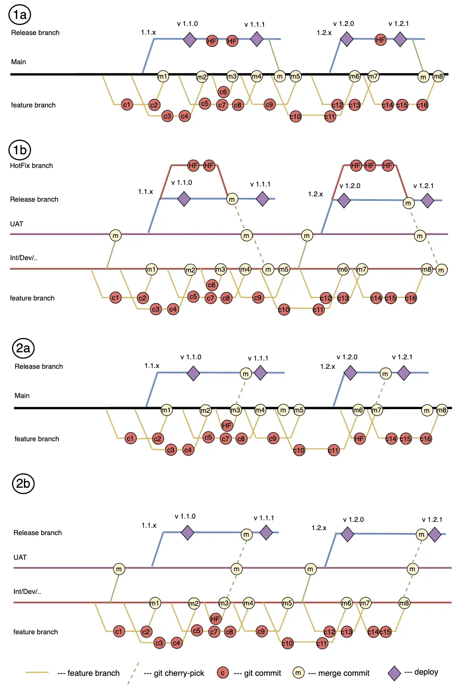

The **Hotfix Git Strategy** aims to deliver fixes to the production environment as quickly and reliably as possible. The hotfix strategy is an integral part of the overall change management and deployment strategy adopted for the project.

Hotfix strategies can be divided into two types:
- **Requiring Backpromotion**: This type of strategy is used when the project has multiple branches. In this case, the hotfix is made in the branch closest to the production state. After deploying the changes to production, the backpromotion (promotion of changes) is performed to the remaining active branches of the project.
- **Not Requiring Backpromotion**: This type of strategy is used when the main development branch and the production state do not differ (trunk-based development) or when the differences are minimal (small projects with a relatively short development cycle and a small number of teams). In this case, changes are made to the main development branch and, if necessary, transferred to the branch corresponding to the production state using cherry-pick or merge.

## Implementation Examples
1a, 1b - Strategies with backpromotion
2a, 2b - Strategies without backpromotion

It is important to note that the approach is flexible, and hotfixes can occur both in separate branches and in the most suitable branches for this purpose.

## Features
The main factor in choosing whether to use backpromotion or not is the size of the project and the Git strategy.

**Hotfix with Backpromotion**
On projects with a large number of teams and a long development and delivery cycle, it is more appropriate to make changes in the branch corresponding to the production state, and then promote the changes to the developer branches. This minimizes the time required to deliver the fix to the production environment. Further promotion of the fix to the developer branches may lead to conflicts, which there will be sufficient time to resolve.

**Hotfix without Backpromotion**
If the development and delivery cycle on the project is short, it usually makes sense to use the regular development cycle for hotfixes. The likelihood of conflicts when transferring changes to the release branch in this case is minimal. The absence of the need for backpromotion reduces the complexity of branch management and simplifies the development process.
