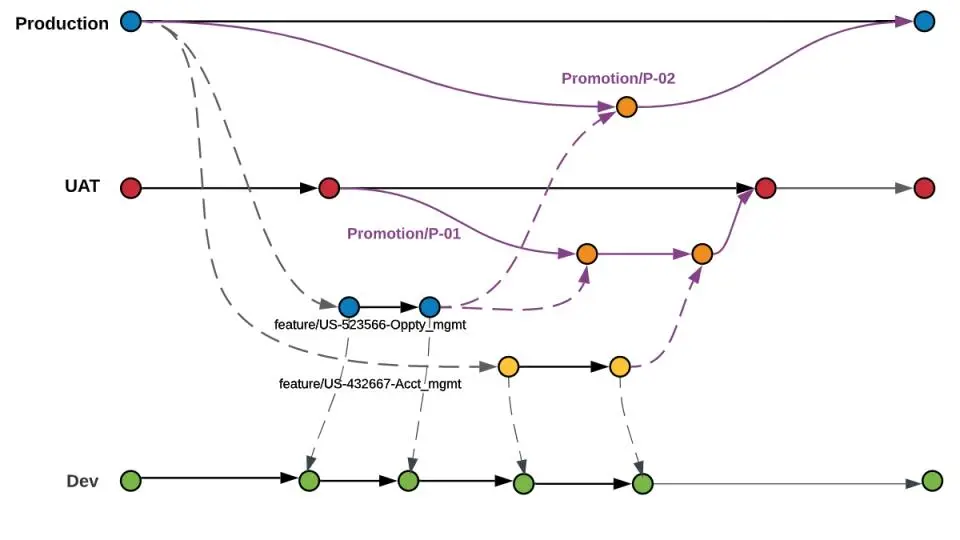

**Copado Branching Strategy** is recognized as an independent strategy due to its unique approach to building a Git strategy. This strategy is part of the change delivery process using the Copado tool. It involves the use of separate branches for each user story or feature and supports regular back-promotion to synchronize changes between branches.

Copado is a DevOps platform for Salesforce that automates development, testing, and deployment processes. It supports CI/CD, version and release management, code quality control, and testing. Copado integrates with Salesforce, offering process visualization and collaboration. The platform ensures security and compliance with regulatory requirements.

Comparison of tools can be found in the corresponding section
<!-- TODO: Add link to tools -->

### Implementation Examples

Key implementation features, depicted in the diagram, include feature branches created from the Production branch but containing changes from the Dev environment. Feature branches are created automatically, and Copado allows retrieving changes from selected sandboxes into them. When moving changes to UAT (branch corresponding to the environment), Copado creates a temporary Promotion branch, where selected feature branches can be merged. The merging process is accompanied by validation and deployment of changes to the selected environment. When promoting changes to Production, the process repeats similarly to the promotion of changes to UAT.

The strategy implementation diagram is taken from the official Copado website documentation [Link](https://docs.copado.com/articles/#!copado-ci-cd-publication/copado-branching-strategy/a/h2__1375207317)

### Advantages

1. **Isolation of Changes**: Each user story or feature is developed in a separate branch.

2. **Branch Automation**: Copado automatically creates and manages branches, reducing manual errors and speeding up the development process. Automation also simplifies branch management and the deployment process.

3. **Regular Back-promotion**: Regular back-promotion support helps synchronize changes between branches, ensuring code consistency and preventing errors.

4. **Built-in Quality Gate**: Copado includes detailed instructions, recommendations, and tools for integrating quality control into the delivery strategy.

5. **Environment-Specific Branches**: The strategy includes branches corresponding to environments, making it easy to track code and changes for the respective environment.

### Disadvantages

1. **Management Complexity**: Despite automation, managing many branches can be challenging, especially in large projects with many developers. Clear processes must be organized to avoid chaos in branch management.

2. **Tracking Changes Complexity**: Changes are recorded in a feature branch created from the base branch (usually the `Production` branch). This approach adds complexity, as changes in commits may not match those made by the developer during extended feature development or with a large number of developers.

3. **Merge Conflicts**: Despite isolating changes, merge conflicts can still occur. In complex projects, conflicts are common due to the nature of forming commits in the feature branch.

4. **Release Formation Complexity with Many Tickets**: When moving a large number of tickets after forming a promotion branch from the target branch, feature branches are merged sequentially. This process can be time-consuming and unpredictable when conflicts are present.

5. **Training and Adaptation**: Effective use of the strategy requires team training and adaptation to new processes, which can take time and additional resources.

6. **Tool Dependency**: High integration with specific tools can create dependency and complicate the transition to other solutions in the future. Inability to significantly influence Git strategy changes, as it is part of Copado, can cause issues if tools are updated or changed.

### Features

Copado Branching Strategy is an integral part of Copado. Copado offers a comprehensive solution and significant automation in managing changes, development processes, and deliveries but requires a careful approach to team training and process organization to achieve maximum efficiency. Release management, automation, and Git strategy are carried out through Salesforce.

### Ideal Project Profile

1. **Small or Medium Projects**: Copado is ideal for projects with a limited number of teams or developers, as the complexity of release management increases sharply with more teams and developers.

2. **Frequent and Small Releases**: Projects requiring frequent and regular releases benefit from using Copado, as it better manages changes and maintains high code quality through centralized management and process automation, minimizing conflicts related to the strategy.

3. **High Code Quality and Testing Requirements**: Projects where thorough testing and quality control are critical can effectively use Copado's capabilities for test automation.

4. **Complex Infrastructure**: Projects with multiple development environments (development, staging, production) benefit from centralized change management offered by Copado, simplifying the deployment process and synchronization of changes between different environments.