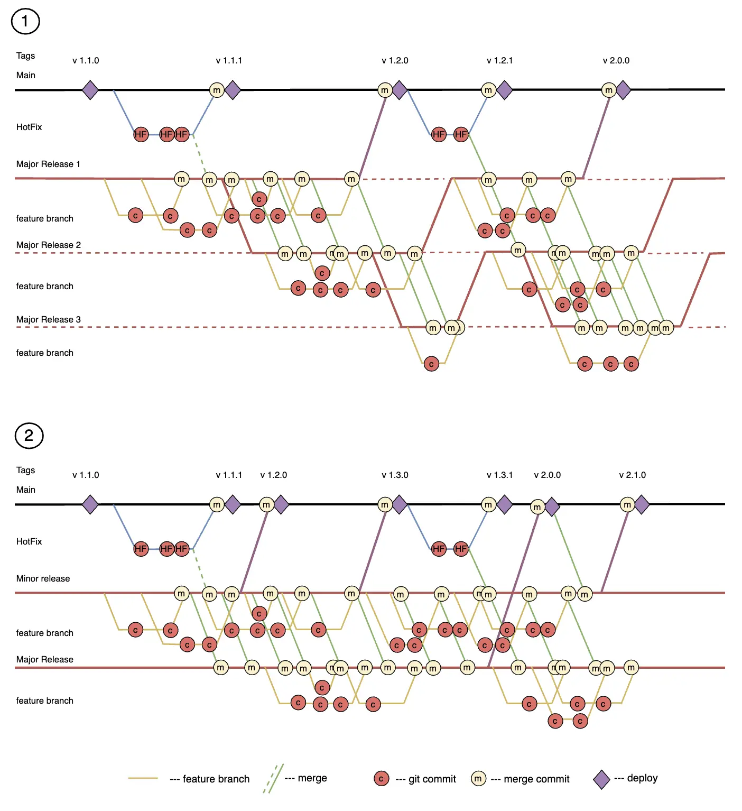

The Parallel Release Git strategy allows managing multiple versions of a product simultaneously. Separate release branches (`release-x.x`) are created for each release, enabling the preparation and testing of different product versions in parallel. Feature branches can be created from `release-x.x` branches, which serve as `develop` branches for the corresponding releases. This approach helps isolate changes and manage multiple product versions simultaneously, which is especially useful for projects with long development cycles and support for older versions. However, it requires strict branch management and synchronization of changes. An important feature is the designation of major and minor releases for their sequential synchronization.

### Implementation Examples

The diagram shows two possible implementations of the strategy. Tags display the versioning example of the release on production: major release/minor release/fix.
1. The first diagram shows an example with three parallel releases. In this implementation, the release order is pre-agreed, but release development can take a long time.
2. The second diagram shows an example with a minor and a major release. The minor release is more frequently deployed to production. The major release can take a long time.

### Advantages

1. **Isolation of Changes**: Each product version is developed in its separate release branch, minimizing the risk of conflicts and simplifying testing.
   
2. **Support for Multiple Versions**: The strategy allows simultaneous support and development of multiple product versions, which is especially useful for long-term projects and products with multiple active versions.

3. **Flexibility in Release Management**: The ability to work on different releases in parallel allows for more flexible responses to changing requirements and priorities.

4. **Simplification of the Release Cycle**: Separating branches for different releases simplifies the preparation and testing process before release.

### Disadvantages

1. **Complexity of Branch Management**: Maintaining a large number of branches requires careful planning and is a labor-intensive task.

2. **Increased Risk of Conflicts**: Although isolation of changes minimizes conflicts, synchronization and frequent merges between branches can still lead to conflicts that require resolution.

3. **Increased Overhead**: Managing multiple release branches may require more resources and time for synchronization and testing.

4. **Need for Strict Discipline**: Successful application of the strategy requires the team to strictly follow established processes and branch management rules.

5. **Potential Complexity in Testing**: Testing changes in multiple parallel branches can be challenging and require additional efforts to ensure code quality.

### Features

A key feature of this strategy is the ability to develop different functionalities in parallel, allowing teams to work on different versions of the product simultaneously. This enables parallel work for a large number of teams and developers, which is especially useful for large and complex projects. Regular synchronizations and merges between branches are necessary to ensure code consistency. This requires a well-constructed release architecture and synchronization process automation. In such strategies, it is important to consider the architectural features of the solutions and ensure that synchronization and merging processes do not disrupt other teams' work. It is also necessary to implement tools for automation and monitoring to simplify the management of multiple parallel branches and minimize the risk of conflicts and errors.

### Ideal Project Profile

1. **Large or Medium-Sized Development Team**: The Parallel Release strategy is especially useful for projects where multiple teams or a large number of developers are working, as it allows them to work on different features and releases simultaneously without interfering with each other.

2. **Complex Projects with Long Development Cycles**: Projects that require support and development of multiple product versions simultaneously are ideal for this strategy. This includes products with long-term support, where updates and fixes for older versions need to be released while developing new features for future releases.

3. **High Requirements for Code Quality and Stability**: In projects with parallel releases, it is possible to control code quality more carefully by testing and stabilizing each release branch before merging it into the main branch. This is especially important for projects where code stability and quality are critical.

4. **Complex Infrastructure and Multiple Environments**: Projects with multiple environments (development, staging, production) benefit from using parallel releases, as this allows managing different product versions and testing them in various environments without interfering with the main development process.

5. **Frequent Releases and Updates**: Projects that require regular and frequent releases can effectively use this strategy to manage multiple parallel branches, allowing faster responses to changes and release updates.

6. **Intensive Integration with CI/CD**: Projects that actively use continuous integration and deployment can easily integrate synchronization and testing processes for multiple branches, simplifying the management of parallel releases and improving automation.