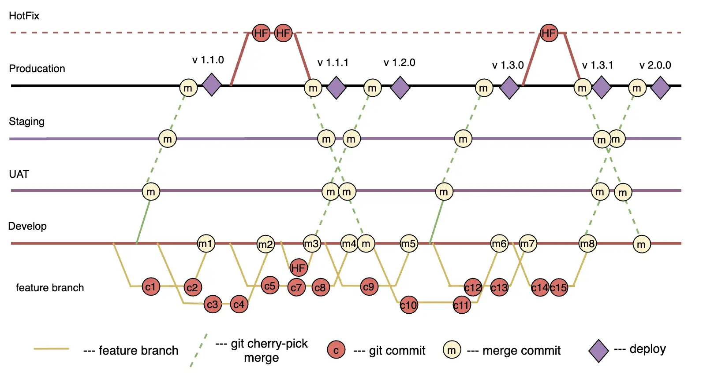

The **Git Org Branch Strategy**, where each branch corresponds to a specific environment (e.g., development, UAT, staging, production), is a useful concept for managing changes and deployments in corporate and large projects. This strategy is common in Salesforce projects due to licensing policies and environment setups that may not allow for full testing environments and limited use of Infrastructure as Code (IaC) approaches.

### Implementation Examples

The example illustrates the strategy's implementation in a project that uses the Develop, UAT, and Staging environments.

Branches/Environments:
1. **Develop/Integration**: A branch for integrating changes developed by developers. This branch is used for merging all features and fixes before they are moved to testing.
2. **UAT**: A branch for User Acceptance Testing. In this branch, users check functionality and compliance with requirements.
3. **Staging**: A branch for final testing before production. Final checks and validations take place here.
4. **Production/Main**: The main branch containing stable code ready for production deployment.

### Advantages

1. **Transparency and Control**: Clear separation of branches by environment provides better transparency and control over changes. Teams can more easily track which changes have been deployed to each environment and which are in testing.

2. **Risk Reduction**: Isolating changes in the corresponding branches minimizes deployment risks. Changes go through several stages of testing (Develop, UAT, Staging, Production) before reaching production.

3. **Improved Testing**: Having separate branches for different testing stages allows for more thorough code testing at each stage. UAT and Staging branches provide the opportunity for user and final testing.

4. **Flexibility in Change Management**: The ability to work independently on different branches allows for more flexible change and release management. This is particularly important for urgent fixes or working on multiple features simultaneously.

5. **Simplification of CI/CD Processes**: It is easier to set up and automate continuous integration and deployment processes for each environment.

### Disadvantages

1. **Branch Management Complexity**: Managing a large number of branches requires careful planning and can be labor-intensive, especially for large teams and projects.

2. **Increased Overhead**: Regular synchronization and management of multiple branches increase project management overhead. This may require additional efforts to automate processes.

3. **Need for Strict Discipline**: Successful application of the strategy requires the team to strictly follow established processes and branch management rules. Violating these rules can lead to chaos and code quality issues.

### Features

The main feature of the strategy is that each branch corresponds to a specific environment, simplifying change management, tracking, and CI/CD setup. This approach ensures isolation of changes at each development and testing stage, minimizing risks and improving code stability.

### Ideal Project Profile

1. **Large or Medium Development Team**: The strategy is especially useful for projects where multiple teams or a large number of developers work in parallel, allowing them to isolate their changes in corresponding branches and minimize conflicts.
    
2. **Complex Projects with Long Development Cycles**: Ideal for complex projects that require multiple rounds of testing and stabilization at various stages before production deployment.
    
3. **Projects with High Quality and Security Requirements**: For projects where code quality and security are critical (e.g., financial applications or medical software), this strategy allows for multi-stage verification before deployment.
    
4. **Projects with Multiple Environments (Development, Staging, Production)**: For projects developed and tested in multiple environments, it is important to clearly isolate changes and manage code versions.