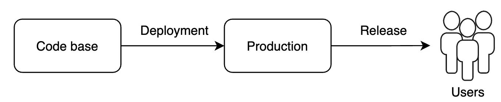
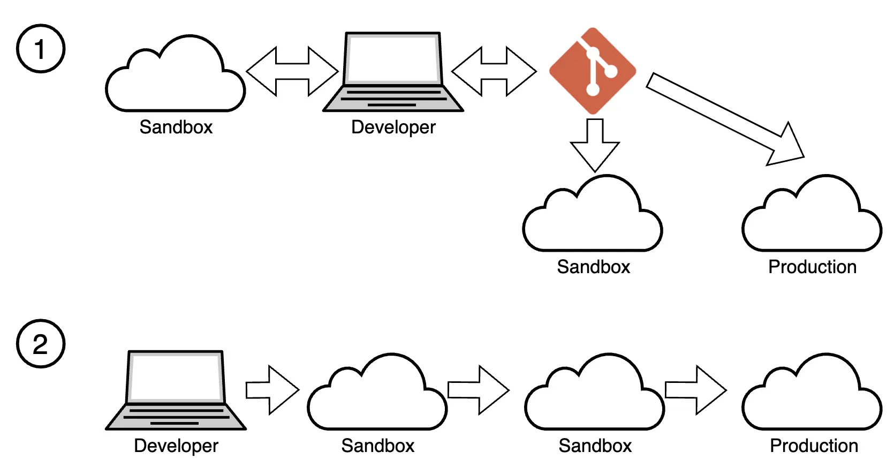

Deployment is an essential stage in the Software Development Lifecycle (SDLC), ensuring the delivery of a finished product to users. This process includes code transfer and environment setup and can be performed manually or automatically. A well-structured deployment process helps avoid errors, minimize implementation time, and ensure system stability.

## Difference Between Release and Deployment

**Release** is the process of officially announcing and providing a new software version to end users. A release includes not only deployment but also user communication, documentation updates, marketing efforts, and support. It marks the point when a new version becomes available to the broader audience, and users can start using it.

[Release management is discussed in a separate section of the portal](../02_01_Release/02_01_01_Release_Management.md)

**Deployment** is the process of delivering changes to the environment. At this point, the code becomes available for use, but not necessarily to all users. Access to deployed solutions is managed within the release process.

Thus, deployment is the technical stage of updating a solution in the environment, but it doesn’t always mean it’s available to end users. A release is a broader process that includes deployment and other activities related to the new version’s launch for users.

Understanding the distinction between release and deployment is important as it allows for better planning and risk management. Releases require detailed planning and coordination, while deployment can be a more routine and regular process. Confusing these concepts may hinder the proper organization of the change process and increase business risks.

## Sources of Truth for Deployment in Salesforce

When deploying changes in Salesforce, there are two main approaches to selecting the **Source of Truth**:

1. **Git as the source of truth** — this is the most advanced and recommended approach for teams wanting to implement CI/CD processes. All changes are committed to Git, which is used for deployment.
2. **Salesforce Org as the source of truth** — this is the traditional approach where deployment is done directly between environments without using Git, which may be convenient for smaller projects.

### 1. Git as the Source of Truth

Using **Git** as the primary source of truth is an approach that is becoming increasingly popular, especially in teams implementing CI/CD processes. All changes, whether code or metadata, are stored in a **Git repository**, and deployment is based on this data.

Git enables tracking changes in code and configurations, managing versions, and facilitating collaborative work among multiple developers on a single project. In the context of Salesforce, using Git helps organize the deployment and release processes and maintain a history of changes.

[Git management is discussed in a separate section of the portal](../02_02_Git/02_02_01_Strategies.md)

**Advantages**:
- **Versioning**: Ability to track every change, use branches for new features, and revert to previous versions.
- **Automation**: Easily integrates with CI/CD tools for automatic deployment, testing, and releases.
- **Quality Control**: Code reviews during repository merging help ensure that only vetted changes are deployed to target environments.
- **Change Control**: Integration of Git with task management systems helps control changes and manage releases.
- **Simplified Rollback**: If a deployment fails, reverting to a previous version is quick.
- **Collaboration**: Multiple developers can work on a single project without risking data loss.

**Tools**:
- **Salesforce CLI (SFDX)**: For working with Salesforce metadata and managing the deployment process through Git.
- **CI/CD Systems**: For example, Jenkins, GitHub Actions, and GitLab CI for automating deployments.
- **Salesforce-Specific Tools**: Salesforce DevOps Center, Gearset, Copado, etc., which provide user-friendly interfaces for Git interaction, branch management, and CI/CD setup. These tools often offer additional features like backups, quality gates, and testing.

### 2. Salesforce Org as the Source of Truth

Before the widespread adoption of DevOps practices and Git, the primary approach was to use the **Salesforce environment (Org)** as the source of truth. This is where changes are made directly in one environment and then deployed to other environments (including Production).

**Advantages**:
- **Simplicity**: Suitable for small teams and administrators who often use a no-code approach and don’t need complex change management processes.
- **Immediate Testing**: Changes can be tested in the same environment where they were made.

**Disadvantages**:
- **Lack of Versioning**: Tracking changes is not as efficient as with Git.
- **Automation Challenges**: Automating deployments and testing requires more effort.
- **Limited Change Control**: Lack of integration between changes in environments and task management systems makes release management a challenge.

**Tools**:
- **Change Sets**: A Salesforce tool for transferring changes between environments.
- **Salesforce CLI and Ant Migration Tool**: Used to extract metadata from one org and deploy it to another. These tools allow for direct deployment without using Git.

## The Role of Manual Changes

Manual changes may be necessary in situations where automation is impossible, too complex, or impractical. For example, manual steps are often needed for activating specific Flow versions, creating or modifying custom labels, executing Apex scripts, activating/deactivating bots, or making data changes.  
[Here you can find possible deployment options for different metadata](https://developer.salesforce.com/docs/metadata-coverage/62).

### Risks and Best Practices to Minimize Manual Interventions

The primary risk of manual changes is the potential for errors. To minimize these risks:
- Document all manual changes.
- Manual steps should be clear and detailed.
- A project policy for recording manual steps should be developed and implemented.
- Automate manual steps whenever possible.
- Perform testing before changes are implemented.

### Tools for Documenting and Tracking Manual Changes

For documenting and tracking manual changes, you can use tools like Jira, Confluence, or simple text files in the repository. It is important that the entire team has access to these documents, can view the history of changes, and adheres to consistent rules for documenting manual steps.

## Data Delivery Methods

In Salesforce, there are two main ways to transfer changes based on the source of truth. One method uses the environment as the source of truth, while the other uses a version control system (Git).

### Source of Truth: Environment

#### Managed Package

**Features**: A Managed Package is a method for distributing and delivering applications and changes in the form of a managed package that can be installed in other Salesforce organizations. Managed packages protect the developer’s source code and data from changes, making them ideal for third-party developers and ISVs (Independent Software Vendors) who want to distribute their products on the AppExchange platform.

**Pros and Cons**:
- **Pros**:
    - Ensures version control, making it easy to release new versions and updates without user intervention.
    - Supports automatic updates for clients, simplifying the distribution of changes.
    - Protects code and data from unauthorized access.
- **Cons**:
    - Less flexible for customization in client organizations, as code and settings changes are restricted.
    - Managing individual components can be challenging due to the need for strict version control.

**Key Commands and Documentation**: Key commands and instructions for creating and managing Managed Packages can be found in [Salesforce documentation](https://developer.salesforce.com/docs/atlas.en-us.packagingGuide.meta/packagingGuide/packaging_packageable_components.htm).

#### Unmanaged Package

**Features**: Unmanaged Packages allow for distributing changes in a package that can be installed in other Salesforce organizations, but unlike a managed package, components can be changed after installation. This is suitable for sharing templates, demo solutions, or internal use where changes and settings can be tailored to client needs.

**Pros and Cons**:
- **Pros**:
    - Allows for component changes after installation, providing high flexibility for users.
    - Suitable for distributing learning materials, templates, and demo solutions.
    - Simple to create and install, without strict version control requirements.
- **Cons**:
    - No version control, making it impossible to manage updates or patches centrally.
    - Open code and components can be modified or deleted in the client organization.
    - No automatic updates, making it difficult to manage further changes.

**Key Commands and Documentation**: More information about working with Unmanaged Packages can be found in [Salesforce documentation](https://developer.salesforce.com/docs/atlas.en-us.packagingGuide.meta/packagingGuide/packaging_packageable_components.htm).

#### Change Set

**Features**: Change Set is a built-in Salesforce tool for transferring metadata between related orgs (e.g., from sandbox to production). Change Set provides a user-friendly graphical interface for selecting and sending components. However, Change Set does not support versioning of metadata, meaning that once deployed, components do not retain information about previous versions.

**Pros and Cons**:
- **Pros**:
    - Easy to use: does not require programming skills.
    - Allows transferring selected components through the standard Salesforce interface.
    - Supports transfers between related organizations (e.g., sandbox -> production).
    - Easy to track the status of a change set (sent, under review, deployed).
- **Cons**:
    - Lack of metadata versioning: once deployed, components cannot be rolled back.
    - Limited to related organizations: cannot send changes to unrelated orgs or other Salesforce instances.
    - Does not support integration with deployment automation tools (e.g., CI/CD).
    - Does not support transferring all types of metadata, which may require the use of other tools.
    - Limited flexibility in managing component dependencies.

**Key Commands and Documentation**: The description of working with Change Sets can be found in [official documentation](https://help.salesforce.com/s/articleView?id=sf.changesets.htm&type=5).

### Source of Truth: Git

#### Unlocked Package

**Features**: Unlocked Packages were introduced as part of the new Salesforce DX architecture. Using Unlocked Packages allows for more flexible change management compared to Unmanaged Packages. The main purpose of Unlocked Packages is to manage components during development and deliver changes with a more controlled structure, including support for CI/CD processes.

**Pros and Cons**:
- **Pros**:
    - Easier to update and manage compared to Unmanaged Packages.
    - Supports versioning and integration with CI/CD processes.
    - Suitable for internal use and development, especially for creating modular packages.
- **Cons**:
    - More complex to set up and manage for beginners compared to Unmanaged Packages.
    - Does not protect code like a Managed Package.

**Key Commands and Documentation**:  Salesforce DX Developer Guide [Unlocked Packages](https://developer.salesforce.com/docs/atlas.en-us.sfdx_dev.meta/sfdx_dev/sfdx_dev_unlocked_pkg_intro.htm)

#### Metadata API Project (Metadata Format)

**Features**: The **Metadata API Project** (or Metadata Format) is the format used when working with Salesforce metadata through the **Salesforce Metadata API**. This approach allows exporting, modifying, and deploying metadata outside Salesforce in the form of files and folders. The Metadata API is used to transfer and manage metadata between Salesforce orgs or integrate with external systems through automation tools (e.g., CI/CD). This format is particularly useful for more complex development scenarios when managing large projects and using version control systems like Git.

**Pros and Cons**:
- **Pros**:    
    - Versioning support: easily integrates with version control systems (e.g., Git), allowing you to track and manage changes.
    - Supports many types of metadata not available through other methods (e.g., Change Set).
    - Ideal for complex projects, teamwork, and CI/CD integration.
    - Allows automating change transfer using scripts or specialized tools (e.g., Jenkins or GitLab CI).
    - Full control over exporting and deploying metadata.
- **Cons**:    
    - More complex to set up and use compared to Change Sets and requires knowledge of working with APIs and external tools.
    - Deployment through the Metadata API can be slow, especially for large metadata sets.
    - Labor-intensive for small changes, as it requires careful control of component dependencies.
    - Deployment errors can be difficult to diagnose, especially in complex projects.

**Key Commands and Documentation**: Description of working with Metadata API is available in [Salesforce documentation](https://developer.salesforce.com/docs/atlas.en-us.api_meta.meta/api_meta/meta_intro.htm).

#### Salesforce DX Project (Source Format)

**Features**: **Salesforce DX Project (Source Format)** is a format for organizing source code and metadata, introduced with Salesforce DX (Developer Experience). Unlike **Metadata API Format**, **Source Format** organizes metadata more modularly and structurally. This format is designed for easy version control integration, modular development support, and improved teamwork. It is especially useful for managing metadata within CI/CD processes.

**Pros and Cons**:
- **Pros**:    
    - Supports modular development: source code and metadata are broken into smaller parts, making them easier to manage.
    - Full integration with version control systems (e.g., Git), improving change tracking and collaboration.
    - Supports CI/CD processes and deployment automation.
    - Simplifies working with packages, allowing easier management of component dependencies and versions.
    - Allows working with a local version of the project, making development and testing more flexible.
    - Easily converts to **Metadata Format** for subsequent deployment.
- **Cons**:    
    - Requires a higher technical skill level for setup and use compared to traditional tools like Change Set.
    - Can be complex for small projects where CI/CD or team collaboration is unnecessary.
    - Requires using **Salesforce CLI** and additional tools, which may be unfamiliar to developers previously using only Salesforce’s standard interfaces.

**Key Commands and Documentation**: Detailed information about Salesforce DX can be found in [Salesforce DX documentation](https://developer.salesforce.com/tools/sfdxcli).