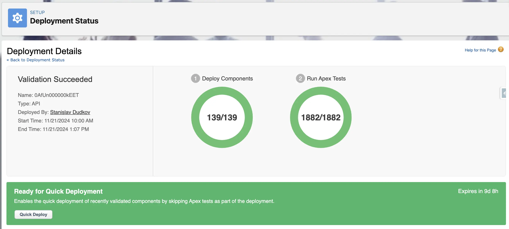

**Quick Deploy** is a Salesforce feature that speeds up the deployment process if validation with necessary test (unit tests) execution has been successfully completed beforehand. Quick Deploy is useful in situations where deployment needs to be performed at a specific time, minimizing the cost of re-testing, as testing was completed during validation. This method enables preparation for deployment in advance by validating changes, allowing deployment within a specific time window (e.g., to minimize business disruption or synchronize deployment with other events).

Quick Deploy is available if deployment with test execution was successful in the last few days. However, changes in the target environment can cause errors during Quick Deploy, so relying solely on a "successful" status is not always risk-free. Quick Deploy can be accessed both through the user interface and via Salesforce CLI.

### Advantages
1. **Time Savings on Deployment**: Quick Deploy allows skipping test execution if validation was successful, significantly reducing overall deployment time, especially for large projects with many tests.
2. **Preparation of Change Package**: Quick Deploy and prior validation provide the team with as much preparation time as needed without impacting the target environment. Successful validation allows for a subsequent fast deployment.
3. **Deployment Planning**: Quick Deploy allows teams to detect errors in advance and prepare changes for deployment at a scheduled time, minimizing business impact. This is particularly relevant for large-scale changes and when additional production testing is required.

### Disadvantages
1. **Limited Usage Window**: Quick Deploy is only available for a few days after successful validation, requiring careful release planning, especially for projects with infrequent releases.
2. **Risk of Outdated Test Results or Environment State**: Quick Deploy relies on previously executed test results. If there are untested changes in the target environment, issues may arise. Metadata changes in the target environment can also cause errors when attempting Quick Deploy.
3. **Requirement for Prior Testing**: Quick Deploy requires successful validation with full testing, so it cannot be used without preliminary validation.

### When It’s Justified

Quick Deploy is appropriate for deployments involving a large volume of changes or a substantial number of tests. Validation and subsequent Quick Deploy allow for scheduling deployment in the target environment in advance. This is especially useful if deployment timing is critical, as testing can be completed ahead of time, reducing overall deployment time within the designated timeframe.

### Using Quick Deploy

When running validation with test execution using the command:  
`$ sf project deploy validate --manifest <path/to/package.xml> --target-org <alias> --test-level RunSpecifiedTests --tests <test name>`  
or  
`$ sf project deploy validate --manifest <path/to/package.xml> --target-org <alias> --test-level RunLocalTests`  
Note: (examples provided use deployment with `--manifest`, but `--source-dir` can also be used).

You will receive a Deployment ID, and if validation is successful, you can use this ID to initiate a Quick Deploy.  
To do this, use the command:  
`sf project deploy quick --job-id <Deploy ID>`  

You can also use the UI for a manual launch.  
To do this, go to `Setup > Deployment Details`  
and click `Quick Deploy` from the list of successful deployments/validations:

or navigate to the deployment page itself:

This will trigger a deployment with a new ID, but without running tests again.