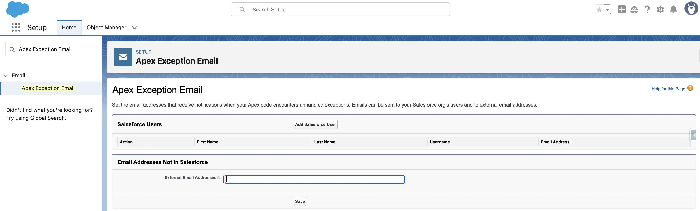

When developing applications and automation on the Salesforce platform using Apex, there may be situations where the code executes incorrectly, causing errors or failures. Such issues can go unnoticed, affecting business stability. 

**Possible consequences include:**
- **Undetected errors in Apex code**, leading to data corruption or loss.
- **Lack of timely response to critical errors** because administrators and developers are unaware of failures in time.
- **Difficulty in identifying the root cause of failures**, resulting in prolonged troubleshooting in the production environment.

In addition to solutions described in this section, as well as unit testing and deployment methodologies, Salesforce provides the **Apex Exception Email** feature.

**Apex Exception Email** is a built-in Salesforce mechanism that automatically **sends notifications to administrators** when **unhandled exceptions** occur in Apex code.

## General Information About Apex Exception Email
**How Does It Work?**
1. If an **error occurs in Apex code** and it **is not handled (not caught by `try-catch`)**, Salesforce automatically logs it.
2. The system **generates an email notification** with error details.
3. The email is sent to the **organization owner (Org Owner) and users specified in the Exception Email Addresses settings**.
4. Developers can quickly respond to issues **without manually checking logs**.

**The email notification includes:**
- **Class and method name** where the error occurred.
- **Exception type** (e.g., `System.NullPointerException`).
- **Line of code that caused the failure**.
- **Error message**.
- **Stack trace**, showing which methods were called before the error.
- **Organization ID (Org ID)** and **record ID** associated with the error (if applicable).

**Important Considerations:**
- **Recipient limit:** Notifications are sent to the organization owner (Org Owner) and up to five additional email addresses specified in Salesforce settings.
- **No flexible filtering or routing:** Notifications cannot be sent based on specific exception types or conditions.
- **Limited control over email content:** Salesforce generates a standard email format, which cannot be customized.

## Advantages and Disadvantages
### Advantages
- **Automatic alerts** – no need to manually analyze logs, errors are reported instantly.
- **Simple setup** – easy built-in configuration without writing additional code.
- **Faster error resolution** – allows developers to quickly fix critical issues.
- **Captures errors from asynchronous processes** – useful for Batch Jobs and Queueable.

### Disadvantages
- **Only reports unhandled exceptions** – if `try-catch` is used, the error won’t be included in the notification.
- **Can lead to excessive email notifications** – if systemic errors exist in the code, dozens of emails may be sent in a short time.
- **Not a replacement for full monitoring** – provides only basic information and lacks customization options.
- **Only supports email notifications** – cannot be automatically integrated with external systems (e.g., Slack, SIEM).

## Recommendations for Using Apex Exception Email
To use Apex Exception Email effectively, follow these recommendations:
1. **Configure notifications for the right recipients**:
    - Use only work emails of administrators and developers who can respond quickly to errors.
    - Avoid sending notifications to general email addresses to prevent important messages from getting lost.

2. **Don’t rely solely on Apex Exception Email**:
    - If you have multiple automated processes and integrations, use Apex Exception Email alongside other monitoring tools (e.g., Debug Logs, Real-Time Event Monitoring, or external SIEM systems) for comprehensive system monitoring.

3. **Regularly review the recipient list**:    
    - Update the recipient list when there are changes in the development or administration team to ensure notifications reach the right people.

4. **Implement custom Exception Handlers in Apex**:    
    - For more flexible notification management, especially in complex projects, create custom exception handlers in Apex that can send customized notifications and integrate with external systems (e.g., Slack, Email-to-Case).

## Conclusion
Apex Exception Email is a simple yet powerful built-in tool for quickly notifying administrators and developers about critical errors in Salesforce. It is especially useful for small and medium-sized projects with relatively simple automation and a small number of developers.
For larger projects with complex integrations, extensive Apex code, and automation processes, Apex Exception Email should be used as a supplementary tool, alongside custom exception handlers and external monitoring solutions.