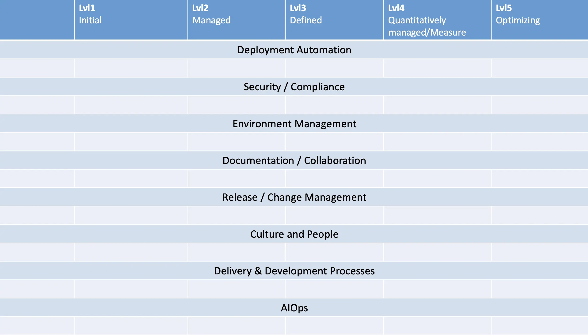
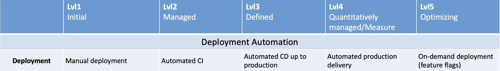

Every growing development company sooner or later encounters the need to implement DevSecOps practices.
Typically, the first elements implemented are CI/CD and data backup. Often, developers are made responsible for implementing and maintaining these practices, even though this is not their core responsibility. Current DevSecOps tasks are also frequently addressed without a strategic roadmap and often without a deep understanding of their necessity.

As a result, companies commonly encounter these typical problems:
- Fragmented and poorly automated or completely manual processes;
- Lack of coordination between Dev and Ops teams;
- Inconsistent or absent security (Sec) control;
- No clear understanding of current process maturity and potential for growth;
- Chaotic changes leading to errors and incidents;
- Suboptimal tool choices;
- Slow and unreliable incident resolution;
- No compelling business justification for investment in automation and security.

These issues slow product development and increase technical debt. Most importantly, they hinder a systematic approach to improving CI/CD, leading to both financial and reputational losses.

Creating a **DevSecOps process maturity matrix**, followed by a **roadmap for improvements**, and incorporating **continuous improvement practices (ITIL 4)** and **integrated security (DevSecOps)** becomes a powerful model for team and process growth.

## The Purpose of Creating a DevSecOps Maturity Matrix
A DevSecOps maturity matrix helps to:
- Assess the current maturity of CI/CD and security processes.
- Clearly define the current state and target maturity levels.
- Align specific improvement initiatives with teams and the business, and prioritize them.
- Implement a proactive approach to security (DevSecOps).
- Choose optimal practices and tools.
- Create a transparent, comprehensible process improvement roadmap.

Combined with ITIL 4's **Continual Improvement Register (CIR)** <!-- TODO: add link to CIR -->, this approach becomes even more effective. It helps minimize risks when introducing changes to production environments and optimizes costs.

## The DevSecOps Continual Improvement Cycle
The continual improvement cycle is not a one-time activity but an ongoing background process that supports every sprint, release, and team evolution. It enables sustainable development of technologies, practices, teams, and project culture.

Key elements of the cycle:
- **Understand the purpose of improvement**: Define what needs to be improved, why it matters to the business, and what value the changes will bring.
- **Analyze the current state**: Use tools like the DevSecOps maturity matrix to objectively assess the current maturity level of processes.
- **Determine the next maturity level**: Define the desired state of processes based on the matrix.
- **Build a roadmap**: Detail the steps, tasks, and initiatives needed to reach the next level and break them down into manageable parts.
- **Implement improvements**: This might include introducing new tools (e.g., static code analysis), changing processes (e.g., permission set audits), or developing team practices.
- **Evaluate results and adjust**: Define **measurable metrics** and conduct regular retrospectives to assess progress. Ensure improvements provide real business value, not just task completion.

To maintain sustainable impact:
- **Schedule regular reviews** (e.g., quarterly) of process relevance, priorities, and task statuses. This helps maintain focus and respond to changes promptly.
- **Use a Continual Improvement Register (CIR)** <!-- TODO: add link to CIR --> — this helps systematically record improvement ideas, track initiatives, and support an evolutionary approach to DevSecOps.
- **Keep the maturity matrix and roadmap up to date** — as business goals and technologies change, processes should adapt accordingly.
- **Focus on real business impact** — measure results through product and team KPIs, not just completed tasks (<!-- TODO: add link Metrics and KPIs  -->).
- **Foster a culture of continual improvement** — it should become embedded in the project's DNA, not treated as a one-off effort. Teams should be actively engaged in improvements.

The maturity matrix in this process is not just a diagnostic tool, but a **driver of change**, helping maintain focus on holistic development. The matrix and its review help processes to be flexible and responsive to changing business priorities.

## Creating the Maturity Matrix

### Transformation Team
As described later, the DevSecOps maturity matrix covers all processes related to delivering customer value and supporting end users. Because this is an end-to-end process, it cannot be changed by a single department alone. Therefore, a good practice would be to identify and designate a group of individuals from areas such as:
- Team management
- Product management
- Development management
- Support management
- Security management
- Environment management

Other involved stakeholders should also participate to help accurately identify processes and their maturity levels — and support transformation efforts in their areas.

### Maturity Levels
There are five levels of maturity:
1. **Initial** — Traditional environment, Dev and Ops are siloed. No automation. Practices and tools are minimal or absent.
2. **Managed** — Early mindset shift towards agility in Dev and initial automation in Ops, with an emphasis on collaboration.
3. **Defined** — Organization-wide transformation begins with defined processes and established automation.
4. **Quantitatively Managed/Measured** — A deeper understanding of processes, with continuous improvement and the active use of metrics.
5. **Optimized** — Fully integrated continuous improvement. Adaptive processes optimized through regular metric analysis.

Note: Not every process will necessarily reach Level 5. Much depends on the project's characteristics.

### Step 1: Define Sections
First, define the **key sections of DevSecOps processes** - that is, the areas in which maturity can and should be measured. This will also help to involve the necessary responsible individuals for the areas corresponding to these sections.
**Example sections:**
- **Deployment Automation** — CI/CD automation, minimal manual steps, Quality Gates integration.
- **Security / Compliance** — test coverage, code security, access control.
- **Environment Management** — logging, monitoring, alerting, and environment control.
- **Documentation / Collaboration** — internal processes, onboarding, documentation.
- **Release / Change Management** — release workflows, approvals, communications.
- **Culture and People** — team organization, collaboration, skill sets.
- **Delivery & Development Processes** — outcome of maturity in other areas: includes delivery, metrics, KPIs, and continual improvement.
- **AIOps** — AI/ML-powered automation (log analysis, system monitoring, failure prediction, routine task automation).

Sections may vary depending on company size or team structure, but it’s recommended to consider all areas involved in DevSecOps to get a complete picture of the project and identify growth points. In the provided example, the sections structured to comprehensively cover the key areas for DevSecOps.

### Step 2: Fill Sections with Processes
In the second step, populate each section with its relevant processes. Filling should be done in accordance with the maturity levels. It is important to involve the relevant specialists for each of the sections. The maturity matrix is a **collaborative tool** involving all departments engaged in development, delivery, release, and support.
Example: Deployment process maturity levels:
- Level 1: Manual deployment
- Level 2: Automated CI
- Level 3: Automated CD up to production
- Level 4: Automated production delivery
- Level 5: On-demand deployment (feature flags)

Actual levels will vary depending on project size, complexity, [git](../02_02_Git/02_02_01_Strategies.md) and [release](/docs/category/release) strategies, [batch sizes](../02_01_Release/02_01_07_Batch_Size.md) , and [delivery model](../02_04_Delivery_Strategies/02_04_01_Fundamentals_of_Delivery_Strategies.md).

### Step 3: Define Criteria and Descriptions
In the third step, you need to define for each process and level:
- **Acceptance Criteria** — describe what qualifies as reaching this level (use metrics).
- **Business Impact** — speed, stability, error reduction, etc.
- **Required Actions** — what needs to be done to move from one level to the next.

Be detailed so that even uninvolved employees can understand the expected results and business value.
**Remember**: Automating repetitive tasks is great, but even partial automation should bring value. Show the benefit. At this point, you may revise levels and structure.
**Important**: At this stage, it is already necessary to have a task tracking system for creating tasks corresponding to each level. Decomposition, in this case, will already occur as part of building work with the matrix. For this, it is better to use the **Continual Improvement Register (CIR)** <!-- TODO: add link to CIR --> to register and manage initiatives for improving DevSecOps processes.

### Step 4: Create the Roadmap
Define dependencies between tasks. Besides the linear dependency from a lower maturity level to a higher one, it is necessary to indicate the dependencies between the maturity levels of different processes.
Example: internal training maturity might depend on documentation maturity. Automated delivery may depend on automating manual steps.
Once dependencies are mapped, prioritize and group by quarter.
This results in a **connected development path**, not just a task list, making it easier to align with the team and business.

## Practical Steps for Team Engagement
For the effective creation and implementation of the DevSecOps process maturity matrix, it is extremely important to properly involve the teams. Here are specific steps that will help do this:

### 1. Kick-off Meeting
- Conduct a general intro meeting for all stakeholders (dev, QA, support, security, product management, etc.).
- Explain why the matrix matters, what value it brings to each department and the company, and what role teams play.
- Gather and record feedback immediately.

### 2. Section Workshops
- Hold focused workshops per section (e.g., one for CI/CD, one for security, etc.).
- Let teams propose processes and maturity criteria — this boosts engagement and ownership.

### 3. Appoint Section Owners
- Assign one or two owners per section responsible for keeping it updated.
- They communicate with teams, gather suggestions, and track progress.

### 4. Regular Retrospectives
- Hold monthly or quarterly retrospectives on the matrix.
- Discuss successes, challenges, needed changes to the process or matrix.
- Document decisions and update accordingly.

### 5. Public Recognition
- Acknowledge and reward teams for active participation and successful improvements.
- Use internal company channels (town halls, newsletters) to showcase achievements.

## Conclusion
The DevSecOps process maturity matrix is not just a tool for assessing the current state, but a foundation for the systematic and measurable development of CI/CD and release practices. It helps to move from chaotic improvements to a structured evolution of processes, aligned with business goals.

A well-built matrix enables:
- **Identifying bottlenecks and growth opportunities** based on metrics;
- **Prioritizing and planning improvements**, considering cross-process dependencies;
- **Creating a shared vision between tech and business teams**;
- **Minimizing risk, enhancing security, and accelerating delivery**;
- **Embedding a culture of continual improvement**, not just one-time efforts.

To make the matrix work:
- Involve all process owners — don’t build it alone;
- Integrate with task and improvement planning tools (like CIR) <!-- TODO: add link to CIR -->;
- Track real impact via KPIs, not just completed checklists;
- Regularly review and update the matrix and roadmap to stay aligned with the business.

DevSecOps maturity isn’t a finish line — it’s an ongoing journey. The matrix ensures you stay on track and grow step by step, increasing the value of both your team and product.

## How to Fail at Building a DevSecOps Maturity Matrix
If you want your DevSecOps maturity matrix to fail, follow these tips:

### 1. Build it alone
- Don’t invite anyone to discussions — you know best.
- Ignore the experience and opinions of others — they don’t understand anyway.

### 2. Focus only on tools
- Culture, people, and collaboration don’t matter — just buy trendy tools.
- Skip documentation and training — let people figure it out themselves.

### 3. Choose tools based on hype
- Pick only what’s trendy, without checking if it fits your needs.
- Ignore your actual business constraints and requirements.

### 4. Forget about Continuous Improvement
- Make the matrix once and never update it — once done, it’s perfect.
- Avoid checking process relevance or updating the roadmap.

### 5. Hide information
- Don’t share the matrix state or progress with teams.
- The less they know, the easier they are to manage.

### 6. Ignore feedback
- Feedback is risky — you might have to change things.
- Always say things are fine, even when they’re not.

### 7. Avoid standardization
- Who needs standards? Let everyone do their own thing.
- The more chaotic the approaches, the less anyone knows what to do.
