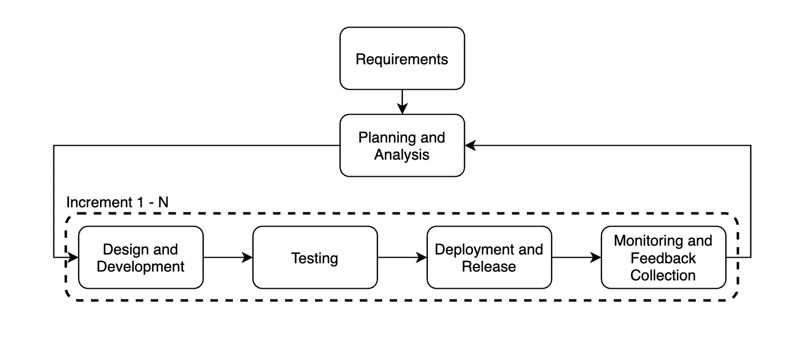

An **incremental release** is a software development and deployment strategy in which updates and improvements are delivered in small, manageable increments rather than large, monolithic releases. This approach increases flexibility, minimizes risks, and speeds up user feedback. An incremental release is particularly well-suited for agile development methodologies like Scrum or Kanban, where projects progress through successive releases that add new features or improvements.

Unlike the release model with a large volume of changes at once, an incremental release focuses on **gradual and continuous delivery**. This ensures thorough testing of each change, continuous monitoring, and adaptation based on user feedback.

## Key Characteristics of an Incremental Release
1. **Small, frequent updates** – Instead of large, infrequent releases, updates are delivered in smaller chunks, allowing for faster implementation of improvements. How the optimal development/release size is determined is explained in the article [Batch Size](docs/02_Practices_and_Processes/02_01_Release/02_01_07_Batch_Size.md)
2. **Integration of user feedback** – Short release cycles enable rapid incorporation of user requests, enhancing user satisfaction.
3. **Risk reduction** – Smaller updates help identify and address potential issues more efficiently by maintaining control over a limited scope of changes.
4. **Increased flexibility** – This approach aligns well with Agile and DevOps methodologies, ensuring quick adaptation to market changes.
5. **Automated testing and CI/CD** – Automation plays a key role in incremental releases, ensuring quality and stability through frequent updates.

## Key Steps in Implementing an Incremental Release
### 1. Planning and Analysis
- **Defining goals and strategy:** Establish a product vision, determine necessary features and improvements, and prioritize them.
- **Requirement analysis:** Gather and document requirements, assessing their impact on the system architecture and infrastructure.
- **Roadmap creation:** Break the overall plan into smaller increments (iterations), identify risks, set timelines, and allocate resources for each release.

### 2. Preparation and Design
- **Architectural planning:** Develop an architecture that facilitates seamless integration of new modules or features, ensuring scalability and flexibility.
- **Increment design:** Plan which specific changes will be included in each release and how they will interact with existing functionality.
- **Infrastructure setup:** Configure development, testing, and production environments, and implement CI/CD processes to automate build, testing, and deployment.

### 3. Development
- **Incremental feature implementation:** Develop new functionalities in small portions, allowing faster issue detection and resolution.
- **Code integration:** Regularly merge new code fragments with the main branch, using version control systems to track changes.
- **Process automation:** Implement automated builds and tests to ensure stability at each stage.

### 4. Testing and Quality Control
- **Unit and integration testing:** Verify the correctness of individual components and their interactions.
- **System and acceptance testing:** Test the entire system to ensure compliance with business requirements and user expectations.
- **Test automation:** Use automated test scripts to improve efficiency and speed up error detection.

### 5. Deployment and Release
- **Pilot deployment:** Launch the increment in a controlled environment (such as a testing or staging environment) to verify stability in near-production conditions.
- **Gradual rollout:** Use deployment strategies like [Phased Rollouts](docs/02_Practices_and_Processes/02_04_Delivery_Strategies/02_04_02_Phased_Rollouts.md) or [Blue-Green Deployment](docs/02_Practices_and_Processes/02_04_Delivery_Strategies/02_04_04_Blue_Green.md) deployment to minimize risks associated with the new version going live.
- **Final release:** After successful pilot testing, the update is rolled out to all users.

### 6. Monitoring and Feedback Collection
- **Continuous monitoring:** Track performance, stability, and security metrics post-release.
- **User feedback collection:** Gather user feedback and analyze metrics to identify potential issues or areas for improvement.
- **Incident response:** Quickly address identified issues and, if necessary, roll back to a previous stable version.
<!-- TODO: add link to monitoring part -->
### 7. Retrospective and Next Increment Planning

- **Evaluation of results:** Assess the success of the implementation and identify strengths and weaknesses.
- **Process improvement:** Adjust development, testing, and deployment methodologies based on feedback.
- **Planning new tasks:** Update the roadmap and prioritize the next increment.

## Advantages and Disadvantages
### Advantages:
1. **Faster time to market** – Early release of a Minimum Viable Product (MVP) allows for quicker hypothesis testing and business solutions.
2. **Reduced deployment risks** – Smaller changes per deployment decrease the likelihood of major failures that can occur with large updates.
3. **Better market adaptation and flexibility** – The approach allows for easy adaptation to changing requirements and priorities during development.
4. **Improved quality** – Integrating small changes simplifies testing and helps detect and fix errors earlier.
5. **Increased project transparency** – Step-by-step development and functional releases provide more clarity for stakeholders.
6. **Higher development efficiency** – Developers work on smaller, manageable tasks rather than complex, large-scale releases.

### Disadvantages:
1. **Complex planning** – The approach requires careful project architecture planning to properly structure increments and mitigate risks.
2. **Risk of incorrect feature decomposition** – Poor segmentation or prioritization can result in an incomplete or inconvenient product in early stages.
3. **Need for coordination** – Frequent releases require seamless collaboration between development, testing, and operations teams.
4. **Dependency management complexity** – Managing dependencies between incremental updates requires robust version control and integration strategies.
5. **Additional automation costs** – A strong reliance on automated testing and CI/CD requires investment in maintaining the necessary infrastructure.
6. **Team skill requirements** – Implementing incremental releases demands a highly skilled team proficient in relevant tools, technologies, and modern DevOps and CI/CD practices.

## Project Suitability and Approach Evaluation
|**Characteristic**|**Suitable**|**Not Suitable**|
|---|---|---|
|**Project Size and Complexity**|Projects that can be broken down into relatively independent modules or features, such as web applications, mobile apps, SaaS products, and other systems where individual components can function autonomously.|Large, monolithic systems with complex architecture and many interdependencies. In such projects, breaking them into increments may lead to integration and compatibility issues.|
|**Product Requirements**|Projects with dynamically changing requirements that need quick adaptation to market and user needs. The incremental approach allows flexible response to changes and adjustments during development.|Projects with rigidly defined requirements that must strictly adhere to the initial plan.|
|**Time Constraints**|Projects where launching a Minimum Viable Product (MVP) quickly is critical to gaining user feedback and market advantage. Incremental releases enable faster execution.|Projects with very tight deadlines where there may not be enough time for planning and implementing increments. In such cases, alternative optimization methods may be required.|
|**Resources and Project Maturity**|Projects with a sufficient number of skilled professionals who can handle frequent releases and changes. The team should have experience with version control systems, test automation, and CI/CD tools.|Projects with limited resources, where a lack of personnel or expertise may hinder the incremental approach. In such cases, additional training or hiring external experts may be necessary.|
|**Development Culture**|Teams following agile development methodologies like Agile. Incremental releases align well with these approaches and maximize efficiency.|Projects with a traditional "waterfall" development model, where all stages are executed sequentially and changes are difficult to implement. Transitioning to an incremental approach may require significant cultural and process changes.|

## Conclusion
An incremental release provides a **flexible, efficient, and user-centric** approach to software development and deployment. By leveraging automation, feature flags, and continuous monitoring, teams can **deliver value faster, reduce risks, and quickly respond to market changes**.

Successful adoption of incremental release strategies requires careful planning, robust CI/CD pipelines, and a focus on testing and feedback integration. However, when implemented correctly, this approach leads to **higher software quality, increased user satisfaction, and a more adaptive development cycle**.
