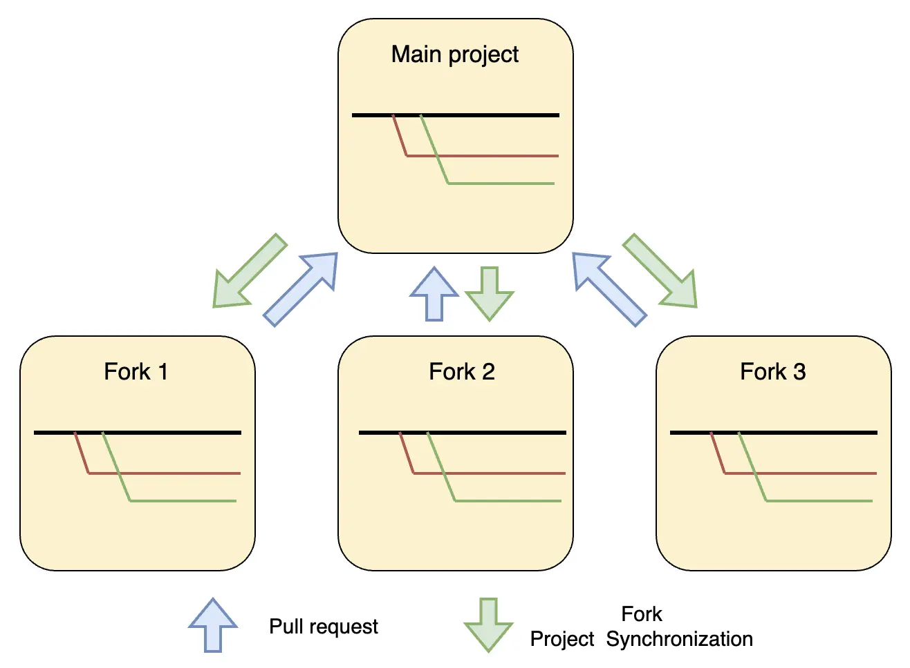

The Fork Git Strategy is an approach to repository and branch management primarily used in open-source projects but can also be effectively applied in corporate projects. This strategy allows developers to work on a project without having direct access to the main repository. Instead, they create their own copies (forks) of the main repository and make changes to them. The Fork Git Strategy provides an excellent solution for isolating changes, enhancing security, and ensuring code quality, but it requires careful organization and management, especially in a corporate environment. This strategy is effective for projects with a large number of contributors and external contractors.

### Implementation Examples

The example illustrates three fork projects from the main project. 
Each developer of the three fork projects works as with a regular project, but merging with the main project occurs through a pull request. This includes quality control and, if necessary, discussions on possible solutions implemented in the fork project.

### Advantages

1. **Isolation of Changes**: Forks allow developers to work on their changes in separate copies of the repository, minimizing the risk of conflicts and errors in the main repository. This is especially useful when developing new features or experimental changes.

2. **Code Security**: The main repository remains protected from direct changes since all modifications go through a code review process before merging. This enhances security and code quality, as all changes are checked and approved before integration.

3. **Development Flexibility**: Developers can work on projects independently without affecting the main development branch. This allows teams to work at their own pace and make changes without needing to coordinate with others until the pull request is created.

4. **Quality Control**: The pull request process includes mandatory code reviews, ensuring high code quality and consistency. It also allows involved developers and teams to discuss and improve changes before merging.

5. **Support for External Contributions**: The fork strategy simplifies working with external contractors and freelancers, allowing them to make changes in isolated copies of the repository. This helps easily integrate their work after review.

### Disadvantages

1. **Increased Overhead**: Managing forks and synchronizing changes between forks and the main repository can require additional effort and resources. Regular synchronization and conflict resolution can be time-consuming processes.

2. **Management Complexity**: In large projects with many forks, it can be challenging to track all changes and pull requests. This requires a well-organized process and management tools.

3. **Limited Visibility of Changes**: Changes made in forks are not immediately visible to other team members, which can complicate coordination and integration of work. This is especially critical for large and distributed teams.

4. **Risk of Desynchronization**: Infrequent synchronization of forks with the main repository increases the risk of conflicts and errors during merging. This can complicate the integration process and increase the time needed for conflict resolution.

5. **Need for Training and Adaptation**: Effective use of the Fork Git Strategy requires team training and adaptation to new processes. This can take time and require additional resources, especially for teams unfamiliar with this strategy.

### Main Steps of Using the Fork Strategy

1. **Fork the Main Repository**: The developer creates a copy of the main repository in their own account. This allows them to work on the project independently of other developers and without risking damage to the main repository.

2. **Clone the Fork**: The developer clones their fork to their local machine to start working on the project.

3. **Create Feature Branches**: The developer creates new branches for each feature or bug fix. This allows for the isolation of changes and easier code management.

4. **Development and Commits**: The developer makes changes and commits them to their feature branch.

5. **Synchronize with the Main Repository**: Periodically, the developer synchronizes their fork with the main repository to get the latest changes and minimize conflicts during merging.

6. **Pull Request (PR)**: After completing work on a feature or bug fix, the developer sends a pull request to the main repository, proposing to integrate their changes. This allows the main repository owners to review and discuss the changes before merging.

### Ideal Project Profile

1. **Open-Source Project**:
   - **Description**: Ideal for open-source projects where any developer can fork the repository, make their changes, and submit a pull request for review.
   - **Advantages**: The fork strategy simplifies attracting external contributors and managing their contributions, maintaining a high level of code quality through the code review process.

2. **Large or Distributed Development Team**:
   - **Description**: Projects involving large or distributed teams of developers can benefit from change isolation and independent work.
   - **Advantages**: Developers can work on their features or bug fixes independently, minimizing conflicts and improving change management.

3. **Intensive Use of External Contributors**:
   - **Description**: Projects that actively involve external developers, such as freelancers or contractors, to perform tasks.
   - **Advantages**: Forks allow external developers to make changes in isolated copies of the repository, ensuring the security of the main code and simplifying the integration of their work after review.

4. **Complex Corporate Applications**:
   - **Description**: Internal corporate projects with high confidentiality or criticality, where it is important to protect the main code from direct changes.
   - **Advantages**: The fork strategy provides additional security, as changes go through a review process before merging with the main repository, protecting against unverified changes.

5. **Experimental Development and Research (R&D)**:
   - **Description**: Projects related to research and development of new technologies, where it is important to isolate experimental features.
   - **Advantages**: Forks allow researchers to work on experiments independently of the main codebase, minimizing risk to the stability of the main product.