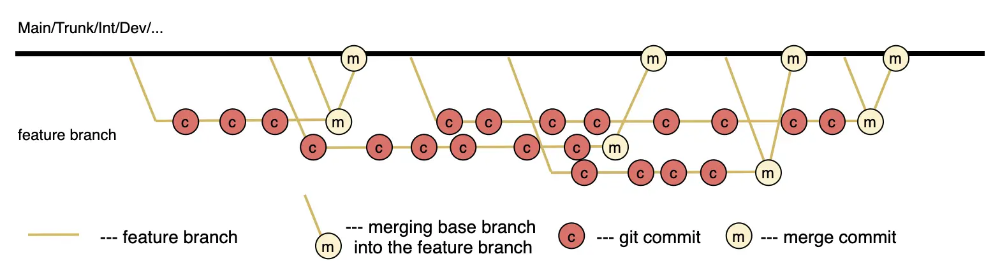

The Feature Branch strategy is an approach to branch management in version control systems where each new feature is developed in a separate branch originating from the main development branch (main, int, dev). This allows changes to be isolated and minimizes risks associated with integration. 
Feature branches exist until the work on the feature is complete and undergo code review and testing before merging with the main branch. 
This strategy enhances flexibility in development management and allows developers to work independently of each other.

## Implementation Examples

Since feature branches typically exist for a long time, periodic updates from the base branch using the merge process can be applied. This allows developers to obtain the current version of the metadata, which may have been changed while they were working on the feature. Before merging the feature branch into the main branch, it is also recommended to update the feature branch for testing and validating the current metadata. In case of conflicts, the developer can resolve them locally and test the solution. 
The example shows implementation scenarios:

## Advantages

1. **Change Isolation**: Each new feature is developed in a separate branch, allowing for isolation of changes and minimizing impact on the main branch.

2. **Quality Gate**: Before merging the feature branch with the main branch, changes undergo code review and testing, helping to maintain code quality and reduce the likelihood of errors.

3. **Development Flexibility**: Developers can work on their features independently and at their own pace, boosting productivity and efficiency.

4. **Simplified Management**: The strategy makes it easy to track progress on each feature and manage changes, simplifying the development and deployment process.

5. **Easy Rollback of Changes**: If a new feature causes problems, changes can be easily rolled back by reverting the merge commit.

6. **Scalability**: The Feature Branch strategy scales well to projects of any size, allowing each developer or team to work on their features independently.

### Disadvantages

1. **Integration Delays and Synchronization Gaps**: Isolated development can lead to delays in integrating changes and losing synchronization with the main branch, especially if branches exist for a long time. This increases the risk of conflicts during merging and complicates management.

2. **Dependency Management Challenges**: In complex projects with many feature branches, managing dependencies between various features can become problematic.

3. **Increased Code Review Workload**: Feature branches can contain a large volume of changes, making code review significantly more complex when opening a merge request.

## Features

To address the shortcomings like the feature branch lagging behind the main branch, it is recommended to update it through merging. This is demonstrated in the implementation examples section. 
Updates should occur as needed, considering the project's specifics.

## Ideal Project Profile

1. **Medium or Large Development Team**: The Feature Branch strategy is well-suited for projects working on multiple features simultaneously, allowing each developer or team to work independently.

2. **Modular Architecture**: The project should be divided into modules or components, allowing for changes to be isolated and minimizing conflicts when merging branches.

3. **Active Use of Version Control Systems (VCS)**: Modern systems like Git facilitate the creation, management, and merging of feature branches.

4. **Continuous Integration (CI) and Quality Gate**: Having a configured CI system that automatically runs tests and checks for each feature branch helps maintain high code quality and reduces the risk of integration issues.

5. **Strong Code Review Culture**: Mandatory code reviews before merging feature branches with the main branch help maintain code quality and enhance collective responsibility for the codebase.

6. **Effective Dependency Management**: The project should use tools and processes to manage dependencies between different feature branches, minimizing risks when integrating changes.

7. **Flexible Development Methodologies**: Using flexible methodologies like Scrum or Kanban helps adapt the development process to current tasks and changing requirements.

8. **Management Support**: Management should support the implementation of the Feature Branch strategy by providing necessary resources and creating conditions for effective team work.

9. **High Level of Test Automation**: Having automated tests (unit tests, integration tests, UI tests) for each feature branch helps quickly identify and fix errors.

