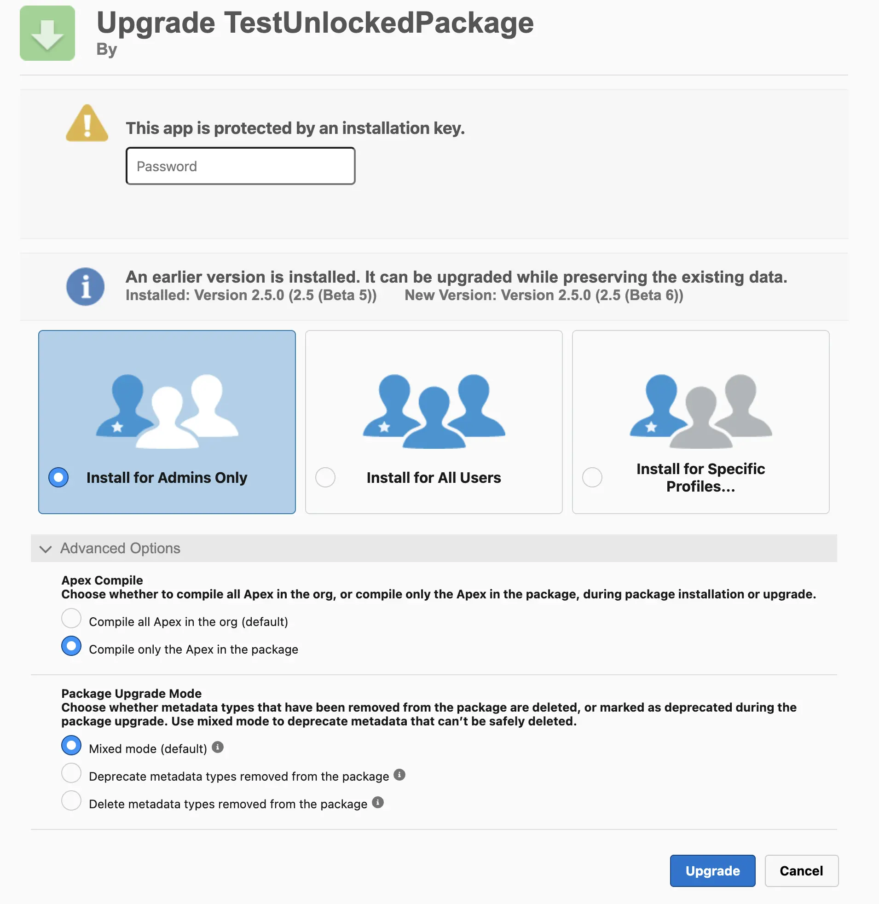

*Unlocked Packages** are a type of package in Salesforce designed to enhance flexibility and modularity in application deployment. Unlike traditional deployment methods, **unlocked packages** support versioning, modularity, and simplified dependency management. These packages are especially valuable for large projects and organizations with distributed environments where automation and version control are essential.

This article continues the discussion from [**Types of Packages in Salesforce**](02_03_07_Packages.md):

## Benefits of Using Unlocked Packages
Unlocked Packages have become a popular solution for internal development for several reasons:
1. **Flexibility and Modularity**: Internal development teams often prefer Unlocked Packages because this approach allows for dividing code into independent modules, making management easier and improving code structure. This is especially helpful for large projects with many interdependent components.
2. **CI/CD Support and Automation**: Unlocked Packages integrate well with CI/CD pipelines, simplifying automation, testing, and deployment. For teams aiming to implement DevOps and automate processes, Unlocked Packages provide the tools and capabilities to improve efficiency.
3. **Versioning and Change Control**: The ability to manage package versions and roll back changes without impacting other system parts is a major advantage for internal development. This is particularly important for companies with strict requirements for update control and version consistency.
4. **Versatility for Multi-Product Organizations**: Unlocked Packages are convenient for companies with multiple production environments, such as those in different regions or serving various business units. The same package can be installed in multiple production environments, supporting consistency and simplifying version management, which reduces development and maintenance costs.

## Ideal Projects and Use Cases
Unlocked Packages are most effective in the following scenarios:
1. **Large and Complex Projects**: In projects with many components and complex dependencies, Unlocked Packages enable codebase structuring. Components can be split into modules, each of which is deployed and updated independently.  
2. **Companies with Multiple Production Environments**: Unlocked Packages are ideal for companies with multiple production environments (e.g., for different regions or business units). The same version of a package can be installed in multiple environments, simplifying change propagation and ensuring consistency.
3. **Projects with Regular Updates**: If a project is evolving rapidly and requires frequent updates, Unlocked Packages simplify change management by allowing individual packages to be updated without redeploying the entire system.
4. **Projects with High Levels of Automation and Quality Control**: For projects with active CI/CD practices, Unlocked Packages enable automated pipelines that speed up testing and deployment of changes.

## Versioning and Version Management
**Versioning** is a key feature of Unlocked Packages. Each build creates a unique package version, which allows for:
- Tracking changes and dependencies between components.
- Performing **rollbacks** to a previous version when necessary.
- Managing functionality and dependencies at the version level, making it easier to introduce new features and fix bugs.

Versioning makes Unlocked Packages particularly useful for projects with frequent changes, where version control and the ability to respond to changes quickly are crucial. Each component and its changes are easily integrated into the main development branch, reducing the risk of deployment errors.

## CI/CD Automation
Automation is one of the key advantages of using Unlocked Packages. They integrate easily into CI/CD processes, supporting the following stages:
- **Package Build**: A new Unlocked Package version is created during the build stage, which can then be tested and stored in a version control system.
- **Automated Testing and Quality Checks**: Unlocked Packages simplify the setup of automatic test launches. When integrated with CI/CD, tests run only for changed components, speeding up verification.
- **Multi-Stage Deployment**: Unlocked Packages support flexible pipelines, allowing changes to be deployed across different environments (dev, test, stage) before final production.
- **Version Control and Rollback**: With built-in version support, CI/CD pipelines can easily roll back to previous versions if the new version causes errors or issues.

Automation allows the team to deploy and test changes without impacting other system components, significantly reducing time and simplifying application maintenance.

## The Role of DevHub

DevHub is a required component for creating and managing Unlocked Packages. DevHub provides the following features:
- **Organizing the Development Workflow**: DevHub manages the creation, updating, and deletion of Unlocked Packages and controls resource allocation across different development stages.
- **Scratch Org Creation**: DevHub simplifies the creation of temporary Scratch Orgs for developing and testing Unlocked Packages, allowing features to be tested independently of the main system.
- **Dependency Management and Project Structuring**: DevHub helps manage dependencies between packages, which is especially important for large projects. DevHub also simplifies the integration of new components into CI/CD pipelines.

DevHub is essential for working with Unlocked Packages, as creating and managing packages in Salesforce DX is impossible without it. DevHub provides a unified interface for administration, version management, and package state tracking, enhancing collaboration among developers, DevOps engineers, and administrators. However, DevHub should be chosen carefully, as changing DevHub requires contacting Salesforce support and can complicate package management.

## Key Commands for Working with Unlocked Packages

**Creating a Package Version**:   
`sf package version create --package <"Your Package Alias"> --installation-key <password> --target-dev-hub <DevHub alias> --code-coverage`  
Note: You can create a version without `--code-coverage`, but such a version cannot be promoted.

**Promoting a Package Version**:    
`sf package version promote --package <ID> --target-dev-hub <devhub@example.com>` 
Note: Only a promoted version can be installed in production environments, including those not linked to DevHub.

**Installing a Package with Settings**:    
`sf package install --package <ID> --target-org <alias> --apex-compile <all|package> --upgrade-type <DeprecateOnly|Mixed|Delete> --security-type <AllUsers|AdminsOnly> --installation-key <password>`  
- The `--apex-compile` parameter is typically set to `package`, though the default is `all`.
- The `--upgrade-type` parameter is often used with the `Mixed` value, which is also the default.
- The `--security-type` parameter is configured according to requirements, with the default being `AdminsOnly`.

You can also install the package manually by using a link in the format:    
`<target org link>/packaging/installPackage.apexp?p0=<package ID>`    

However, you will need to manually enter the password and specify the installation parameters:

## Notes
Although this package type has many advantages, it’s important to consider its limitations, which are outlined in the main article on packages - [link](02_03_07_Packages.md).

Official Documentation: [Salesforce Developers](https://developer.salesforce.com/docs/atlas.en-us.sfdx_dev.meta/sfdx_dev/sfdx_dev_unlocked_pkg_intro.htm)  