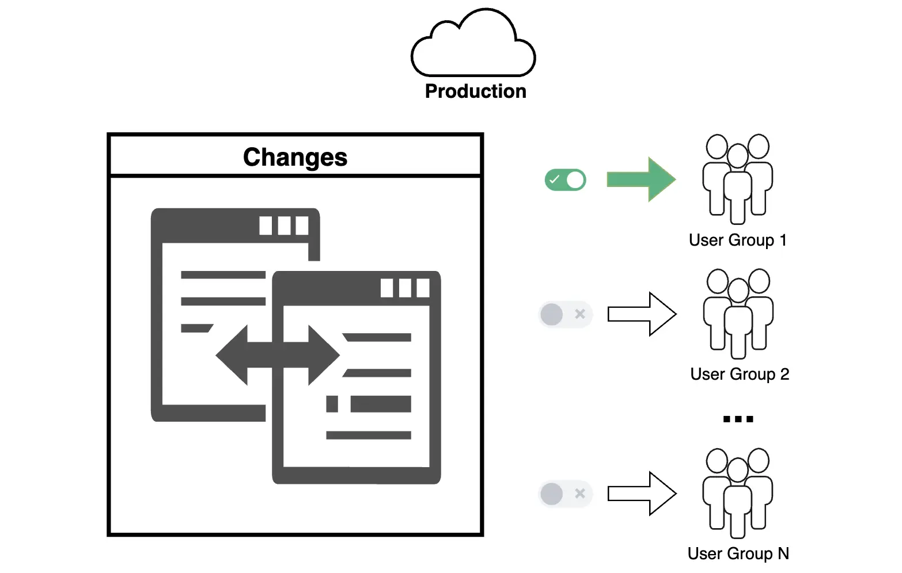

**Phased Rollouts**, or phased deployment, is a general term that describes strategies for implementing changes through gradual scaling. In this approach, new features or updates are introduced to specific groups of users or environments to minimize risks and manage workload effectively.

A specific example of **Phased Rollouts** is a **canary release**, which can also be part of Phased Rollouts. This method involves launching new functionality for a small group of users to test its performance and identify potential issues before a full-scale rollout.

Example: Instead of rolling out a new feature to the entire organization at once, you first enable it for a small group of users, test its stability and performance, collect data and feedback, address any identified issues, and then gradually scale up.

Phased Rollouts are a powerful change management tool, especially for large and complex projects. They allow you to minimize risks, gather feedback, and improve system stability, ensuring a smooth transition to new functionality. However, the success of phased rollouts depends on thorough planning, monitoring, and engagement with users at every stage.

## Key Points for Managing Phased Rollouts
1. **Phase Planning**  
    Define the number of phases, user groups, and criteria for transitioning from one phase to the next.
    
2. **Defining Success Metrics**  
    Establish key performance indicators (KPIs) for each phase. Determine what metrics will signal readiness to move to the next phase.
    
3. **Monitoring and Feedback**  
    Collect data on system performance and progress, monitor for errors, and actively communicate with users involved in the phase.
    
4. **Risk Management**  
    If issues are detected in a phase, halt or roll back changes to minimize business impact.
    
## Implementing Phased Rollouts in Salesforce

### Possible Implementation Methods
The core idea of Phased Rollouts is deploying changes to limited groups of users. Salesforce offers several tools to facilitate Phased Rollouts, ensuring the process is smooth, efficient, and safe. You can implement this mechanism using various features, such as:

1. **Permission Sets and Custom Permissions**
    - Use **Permission Sets** or **Custom Permissions** to manage access to new features depending on the rollout phase.
2. **User Segmentation**
    - Segment users into groups, such as with **Public Groups** or **Roles**, to grant access to features or data only to selected audiences.
3. **Validation Rules and Flows**
    - Configure **Validation Rules** or **Flows** to restrict access or visibility of new objects, records, or fields for users not yet involved in the new phase.
4. **Multi-org Rollout**
    - For companies with multiple Salesforce orgs (e.g., for regional divisions), deploy changes one org at a time, starting with less critical ones.

## Advantages and Disadvantages of Phased Rollouts

### Advantages
1. **Risk Management**  
    Early detection and resolution of issues minimize the impact on end users.
    
2. **Feedback Collection**  
    Gathering feedback from initial users helps improve functionality before a full release.
    
3. **System Resilience**  
    Gradual deployment reduces load and minimizes the risk of failures.
    
4. **Flexibility in Management**  
    It’s easier to roll back changes when they’re deployed to a limited audience. You can respond more flexibly and quickly to business feedback.
    
### Disadvantages
1. **Complexity and Resource Intensity**  
    Requires meticulous planning, monitoring, and communication with teams at every stage, demanding more resources compared to a one-time rollout.
    
2. **Extended Implementation Time**  
    The phased approach often takes longer than a single deployment.
    
3. **Duplication of Efforts**  
    Developers and administrators may need to repeat tasks for each phase.
    
## When Phased Rollouts Are Especially Effective
1. **Large-Scale Deployments**
    - For example, launching a new solution, significantly updating an old one, or making substantial process changes.
2. **Critical Changes**
    - If the changes impact key business processes, phased rollouts help minimize risks.
3. **Organizations with Large User Bases**
    - In organizations with many users, as is often the case with Salesforce, testing performance and user experience on smaller groups is crucial.
4. **Multi-Regional Projects**
    - If a company has multiple production environments (e.g., for different regions), phased rollouts allow gradual deployment in each environment.
5. **Projects with High Automation**
    - For teams using CI/CD pipelines, automating phase management simplifies the implementation of Phased Rollouts.