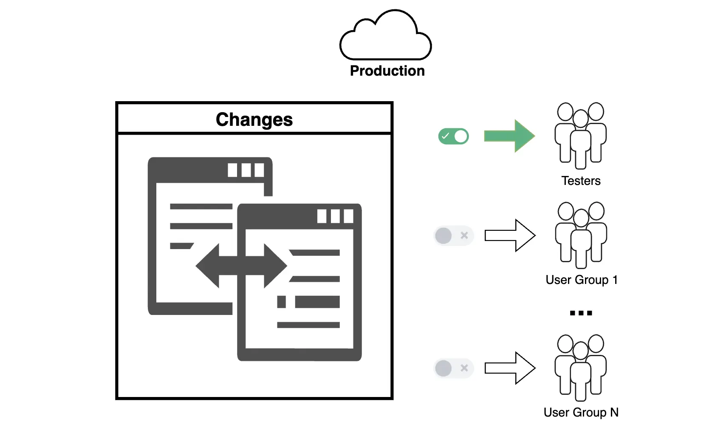

**Dark Launches** are a method of deploying new features into production while keeping them hidden from most users until the official release. The main goal is to deploy the functionality in a real-world environment to test its performance, stability, and integration with existing systems without impacting end users.

Dark Launches are widely used in modern change management approaches, such as **DevOps** and **Continuous Delivery**, to minimize risks associated with new releases.

**For example**, a new feature might be deployed to the production environment but only activated for a limited audience (e.g., internal testers or an admin group) until the team is confident in its readiness for a public launch.

Dark Launches are a powerful tool for improving release quality, especially in Salesforce projects with high loads, complex integrations, or strict stability requirements. When implemented correctly, this approach allows teams to minimize risks, collect key metrics, and successfully roll out changes while ensuring high quality.

## Phased Rollouts vs. Dark Launches: Key Differences
While both approaches focus on risk management and incremental changes, their goals differ:
- [**Phased Rollouts**](docs/02_Practices_and_Processes/02_04_Delivery_Strategies/02_04_02_Phased_Rollouts.md) aim to gradually increase the audience for a feature that is already production-ready.
- **Dark Launches** focus on testing hidden functionality in a production environment before its mass activation.

## How Do Dark Launches Work?
Dark Launches rely on the following principles:

1. **Decoupling Deployment and Activation**  
    The new functionality is deployed in the environment, but its activation is controlled through access management mechanisms (e.g., Feature Flags).
    
2. **Incremental Testing**  
    The feature is activated for a limited group of users (e.g., employees) or on specific data segments.
    
3. **Metric Collection and Feedback**  
    Key performance indicators, such as performance, load, stability, and feedback from test users, are analyzed.
    
## Implementing Dark Launches in Salesforce
Salesforce provides tools that enable effective implementation of Dark Launches. Key strategies include:

### 1. **Feature Flags**
Feature Flags allow functionality to be turned on or off without code changes or redeployment.
- Use **Custom Metadata** or **Custom Settings** to store feature flags.
- Configure logic in **Apex** or **Flows** to check flag status before activating functionality.

### 2. **Custom Permissions and Permission Sets**
- Restrict access to new features for specific user groups via **Custom Permissions**.
- Manage access with **Permission Sets**, enabling feature activation for test groups.

### 3. **Validation Rules and Record Types**
- Configure **Validation Rules** to restrict access to new functionality at the data level.
- Use **Record Types** to manage visibility of new records or fields.

### 4. **User Segmentation**
- Divide users into groups, such as **Public Groups** or **Roles**, to fine-tune access to features or data.

### 5. **UI-Level Control**
- Hide new components or pages in Lightning using **Component Visibility**.
- Use **Apex** or **LWC** to apply conditions for feature visibility in the user interface.

### 6. **Monitoring and Analysis**
<!-- TODO: Apex Debug Log - added link -->
- Log feature usage through **Apex Debug Logs** or custom reports.
- Set up monitoring via **Event Monitoring** to analyze user interactions with the feature.

## Advantages and Disadvantages of Dark Launches
### Advantages
1. **Risk Minimization**  
    Issues can be identified and resolved before the functionality is available to all users, reducing error likelihood.
    
2. **Real-World Testing**  
    The feature is tested in a live environment, uncovering problems not found in isolated tests.
    
3. **Smooth Transition**  
    A gradual rollout ensures a seamless activation for all users after successful testing.
    
4. **A/B Testing Support**  
    Dark Launches can be used to test multiple variants of a feature before its final activation.
    
### Disadvantages
1. **Increased Development Complexity**  
    Implementing Feature Flags and managing hidden functionality requires additional effort.
    
2. **Risk of Prolonged Use**  
    Keeping functionality hidden for too long can lead to code complexity and maintenance challenges.
    
3. **Need for Clear Management**  
    Monitoring systems and processes are required to remove outdated Feature Flags and control feature activity.
    
## Use Cases for Effective Dark Launches
Dark Launches are especially useful in the following scenarios:

### 1. **Performance Testing**
When testing how new functionality will perform in a real-world production environment, Dark Launches allow teams to:
- Assess the feature’s impact on system performance.
- Identify bottlenecks or scalability issues.
- Optimize the system before a mass launch.

### 2. **Compatibility Testing**
In complex projects with integrations or large datasets, Dark Launches ensure:
- The new feature does not conflict with existing processes or systems.
- Risks to integrations and user data are minimized.

### 3. **Gathering Feedback from Key Users**
Dark Launches provide early access to:
- Internal testers.
- Business representatives and key users, allowing for valuable feedback.
- This helps address potential issues and incorporate user requests.

### 4. **Preparation for A/B Testing**
[A/B Tests](docs/02_Practices_and_Processes/02_04_Delivery_Strategies/02_04_06_A_B_Testing.md)
For launching multiple feature variants, Dark Launches:
- Enable testing in a live environment.
- Help choose the optimal variant based on data and user experience.

### 5. **Complex or Critical Releases**
For changes with significant business impact, Dark Launches:
- Ensure stability and security before a large-scale launch.
- Minimize risks of failures and negative user impact.

### 6. **Multi-Region or Multi-Product Projects**
In organizations with multiple production environments, Dark Launches:
- Allow functionality testing in each environment step by step.
- Ensure process consistency and reduce global failure risks.

### 7. **High-Load Features**
For new features involving significant workloads (e.g., mass requests or data processing), Dark Launches:
- Test the feature under real-world load conditions.
- Identify and resolve potential issues before escalation.
