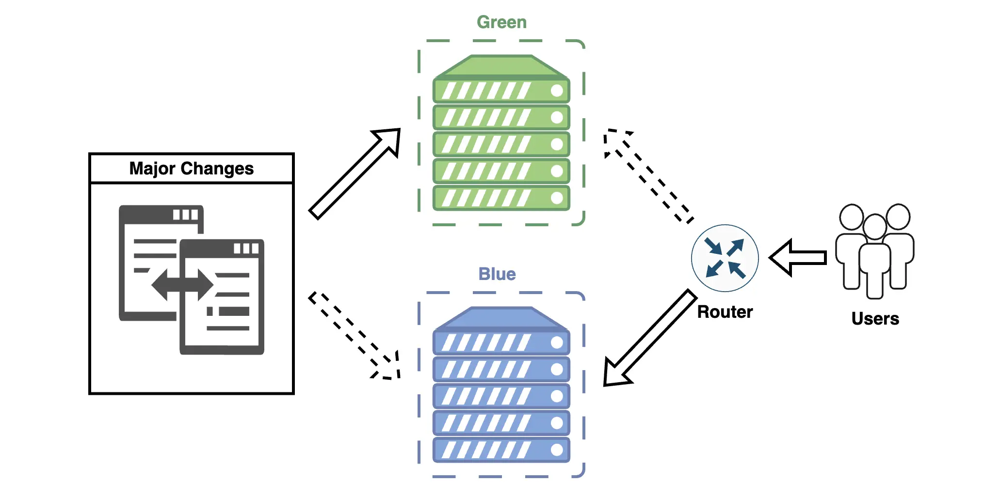

**Blue-Green Deployment** is a deployment and change management strategy in which two identical environments are maintained simultaneously: **Blue (current production environment)** and **Green (new application version)**. Users interact with the Blue environment, while the Green environment is prepared for updates. After successful testing and verification, traffic is switched to the Green environment, which then becomes the new primary production environment.

Unfortunately, implementing this deployment strategy in Salesforce is challenging, but without it, the landscape of possible change delivery methods feels incomplete. At the end of this article, we will discuss the reasons behind these difficulties for Salesforce projects.

### The Core Idea of Blue-Green Deployment
- **Blue (current environment):** The production version of the application that users interact with.   
- **Green (new environment):** The environment with the updated application version, ready for activation.

After successfully testing the new environment, traffic is redirected to the Green environment, while Blue becomes a backup environment for rollback in case of critical errors.

## How Does Blue-Green Deployment Work?
1. **Prepare the Green Environment**
    - Create/prepare an identical copy of the environment for deploying the new version.
    - Deploy updates, configurations, and new features.
    
2. **Test the Green Environment**    
    - Perform performance tests, regression tests, and integration checks.
    - Validate business logic and user scenarios.
      
3. **Switch Traffic**    
    - After successful testing, user traffic is switched to the Green environment.
      
4. **Monitor the New Environment**    
    - Active monitoring of performance and errors is crucial.
    - Collect feedback from users.
      
5. **Rollback (if necessary)**    
    - In case of critical errors, traffic can quickly be redirected back to the Blue environment.

## Advantages and Disadvantages of Blue-Green Deployment
### Advantages
1. **Minimized Downtime:**  
    Users experience no downtime, as switching between environments happens almost instantly.
    
2. **Quick Rollback:**  
    In case of issues, traffic can quickly be switched back to the Blue environment.
    
3. **Real-World Testing:**  
    The new version is tested in the Green environment before switching traffic.
    
4. **Risk Control:**  
    Risks associated with unexpected errors are minimized.
    
5. **System Stability:**  
    The main production environment remains unchanged until testing is complete.
    
### Disadvantages
1. **High Infrastructure Demands and Resource Duplication:**  
    Additional resources are needed to maintain two parallel environments.
    
2. **Complex Management:**  
    Precise coordination is required when switching traffic and managing versions.
    
3. **Data Duplication:**  
    Synchronizing data between Blue and Green environments can present challenges.
    
## Use Cases Where Blue-Green Deployment is Most Effective
### 1. Mission-Critical Systems
- When the platform handles critical business processes, Blue-Green Deployment minimizes downtime.

### 2. Major Releases
- For large updates affecting multiple systems or business processes.

### 3. High Stability Requirements
- In projects where a release failure could result in significant losses.

### 4. Intensive Integration with Other Systems
- If the environment integrates with other platforms, Blue-Green Deployment helps prevent integration disruptions.

### 5. Frequent Releases
- For projects with regular updates, Blue-Green Deployment enables the release of new versions with minimal risks.

## Challenges of Implementing Blue-Green Deployment in Salesforce
Implementing Blue-Green Deployment in its traditional form is difficult in Salesforce due to the platform's unique characteristics, such as its multi-tenant architecture, limited traffic management capabilities between environments, and lack of full infrastructure control.

This means developers cannot directly manage environments, servers, or network routes, as is typically done in traditional systems.

Some critical functions required for Blue-Green Deployment are either impossible or extremely complex to implement in Salesforce:
- Salesforce does not allow direct routing of user traffic between different environments at the infrastructure level.
- Synchronizing data between two environments (e.g., Blue and Green) in Salesforce requires additional integration. Real-time synchronization of transactions and changes between environments is practically impossible.
    
Despite these challenges, understanding Blue-Green Deployment remains essential for developing robust deployment strategies, even if the approach must be adapted for Salesforce's unique architecture.
