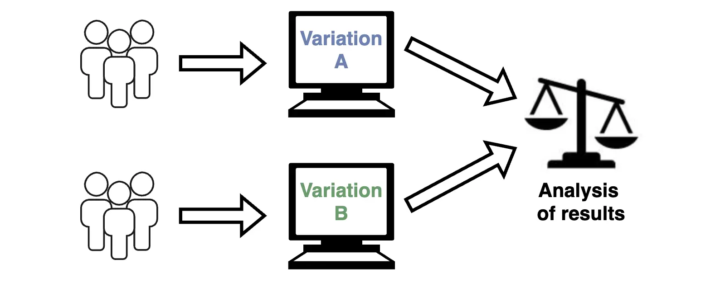

**A/B testing** is a method of comparing two or more versions of a feature to evaluate their effectiveness. The goal of A/B testing is to determine which version better achieves set objectives, such as performance, user experience, or conversion rates. It also helps identify factors that influence user behavior.

In the context of release management, A/B testing minimizes risks when introducing new features by collecting data on user behavior in real-world conditions.

For example, if you are designing a new data entry page but are unsure which layout is more effective, A/B testing can be used. One version (A) is shown to a segment of users, while another version (B) is shown to a different group. Data is then gathered on how each version affects key metrics.

## How Does A/B Testing Work?
The A/B testing process includes the following steps:

1. **Define Objectives**  
    Clearly outline what you aim to test, such as reducing form completion time, decreasing input errors, or increasing conversion rates.
    
2. **Create Versions**  
    Develop two versions of the feature that differ in one or more key parameters, such as field placement or a modified calculation algorithm. Keep in mind that increasing the number of variables can complicate result interpretation.
    
3. **Randomize Users**  
    Divide users into groups, ensuring each group interacts with one version. This ensures the test is objective. Groups should be evenly distributed and representative.
    
4. **Collect Data**  
    Use analytics tools to gather metrics such as completion time, error count, clicks, or conversions.
    
5. **Analyze Results**  
    Compare data between versions to determine which version better meets the objectives.
    
6. **Implement the Best Version**  
    Based on the results, decide on the full rollout of the better-performing version.
    

## Implementing A/B Testing in Salesforce
Salesforce provides tools for implementing A/B testing at both the user interface and business logic levels.

### Implementation Options
1. **Feature Flags**
    - Use **Custom Metadata** or **Custom Settings** as feature flags to control the activation of different feature versions.
2. **Custom Permissions**
    - Restrict access to features using **Permission Sets** and **Custom Permissions**.
3. **Interface Control**
    - Leverage **Lightning Component Visibility** to display different interface versions to different users.
    - Selection logic for versions can be implemented in **Apex Controllers** or **LWC**.
4. **User Segmentation**
    - Divide users into groups using **Public Groups**, **Roles**, or **Queues** for easier version management.
5. **Data Collection**
    - Log user interactions with the feature through **Apex Debug Logs**, **Event Monitoring**, or **Custom Logs**.
    - Create reports and dashboards in **Salesforce Reports** for metric analysis.

## Key Metrics for Evaluating Results
A/B testing focuses on metrics directly tied to experiment goals.  
Some metrics can be "vanity metrics," such as engagement rates, which do not always correlate with business outcomes. Therefore, selecting meaningful metrics is crucial for validating hypotheses. In Salesforce, key metrics include:

1. **Conversion Rate**  
    The percentage of users who perform a target action, such as submitting a form or closing a deal.
    
2. **Completion Time**  
    The time it takes users to complete an action, such as filling out a form or creating a record.
    
3. **Error Count**  
    The number of errors users make while interacting with each version.
    
4. **Engagement Rate**  
    The number of interactions with the feature, such as clicks, page views, or time spent on the page.
    
5. **User Feedback**  
    Insights gathered through surveys, comments, or support tickets.
    

## Advantages and Disadvantages of A/B Testing
### Advantages:
1. **Data-Driven Decisions**  
    Decisions are based on objective data rather than assumptions.
    
2. **Risk Reduction**  
    New features are tested on a limited user group, minimizing risks of failure.
    
3. **Improved User Satisfaction**  
    Optimization based on real data enhances user experience.
    
4. **Flexibility**  
    Testing can be applied to both new features and improvements to existing ones.
    
### Disadvantages:
1. **Complex Setup**  
    User segmentation and version management require additional effort.
    
2. **Data Volume Requirements**  
    Significant user volume is needed for meaningful results.
    
3. **Limited Hypotheses**  
    Testing multiple changes simultaneously complicates result interpretation.
    
## When is A/B Testing Most Effective?
1. **Interface Improvements**  
    Testing new designs or interface changes.
    
2. **Algorithm Testing**  
    Comparing different calculation algorithms, such as deal routing.
    
3. **Evaluating New Features**  
    Assessing the impact of new functionality on users before a full rollout.
    
4. **Sales Funnel Optimization**  
    Testing changes aimed at increasing conversion rates in the sales funnel.
    
5. **Performance Comparisons**  
    Measuring the impact of changes on system speed.
    
