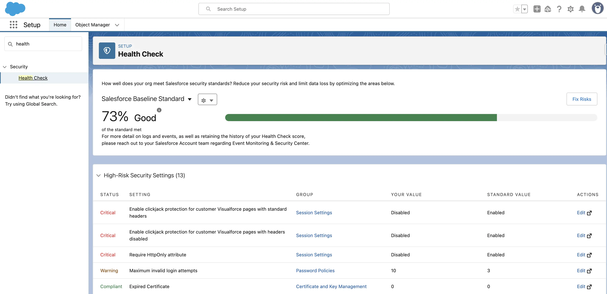

Salesforce stores critical business data, making the security of the environment a top priority. Misconfigurations in security settings or data access and privacy policies can lead to serious consequences, such as:
- Leakage or compromise of sensitive data.    
- Unauthorized access or modification of records.    
- Non-compliance with regulatory standards (GDPR, HIPAA, PCI-DSS, etc.).    
- Financial and reputational damage due to security incidents.    

These issues can arise from, for example:
- Using **weak passwords** or setting excessively long session durations.    
- **IP restrictions** being disabled or improperly configured.    
- **Lack of two-factor authentication (2FA)** for administrators.    
- Migrating configurations between environments without adhering to security standards.    

To minimize such risks, Salesforce provides a built-in tool — the **Security Health Check**, which allows for easy and regular analysis and updating of your security posture.

## Security Health Check – Overview
The Security Health Check evaluates the security configuration of your Salesforce organization based on predefined or custom standards and identifies potential vulnerabilities. It compares your current settings with those defined in a **Baseline Standard**. A notable feature is the ability to create custom Baseline Standards (import/export), tailored to your internal security policies or industry regulations, such as GDPR.

Security Health Check allows you to:
1. Analyze configurations related to **passwords, sessions, lockout policies, access, and API security**.
2. Quickly and visually assess the overall security level of your Salesforce environment.
3. Highlight deviations from recommended settings categorized by risk levels:
    - **High Risk**
    - **Medium Risk**
    - **Low Risk**
4. Receive specific recommendations to improve security and compliance.
5. **Make adjustments directly from the interface**, without leaving the report page.

In this way, **Security Health Check helps maintain a high level of security** by identifying potential vulnerabilities before they become issues, making the process clear and user-friendly.

## Key Features of Security Health Check
**Availability:**  
Accessible via **Setup -> Security -> Health Check**. Available to administrators without requiring additional licensing.

**Ease of interpretation:**  
Analysis is based on comparisons with the baseline and includes a risk severity rating for each setting.

**Simple alignment with best practices:**  
Just click **Edit** next to any item to update it, or use the **Fix Risks** button for quicker adjustments.

**Visual scoring system:**
- **0-33%** – Low security level (Red)
- **34-66%** – Medium (Orange)
- **67-100%** – High (Green)

**Report Export:**  
Results can be exported to CSV for storage and further analysis.

**Custom Baseline Export/Import:**  
Enables you to define your own **Baseline Standard** for assessment, e.g., based on GDPR or HIPAA. This simplifies the rollout of a unified company standard across multiple environments and regions.

## Advantages and Disadvantages of Security Health Check
### Advantages
- **Built-in tool** — no extra costs or integrations needed.    
- **Clear security evaluation** — straightforward scoring and visual indicators.    
- **Quick fixes** — edit settings directly from the interface.    
- **Custom security baselines** — align assessments with internal policies.    
- **Easy export and auditing** — useful for internal or external reviews.    

### Disadvantages
- **Only checks configuration settings** — does not analyze user behavior or actual incidents.    
- **No change history** — past assessment trends are not visible.    
- **Does not cover all security aspects** — access rights, role hierarchies, or sharing rules are excluded.    
- **Limited customization of evaluation logic** — cannot assign custom weights to individual parameters.

## Recommendations for Using Security Health Check
1. **Monitor regularly**    
    - Run Health Check assessments at least monthly, or during major releases and configuration changes.
        
2. **Use Custom Baselines:**    
    - If your organization has **internal security standards**, upload them to compare against corporate policy rather than just Salesforce defaults — especially important in sectors like finance or healthcare.
        
3. **Act promptly on recommendations**    
    - Regularly review Health Check reports and address identified vulnerabilities without delay.
        
4. **Automate report exports:**    
    - Store results (e.g., in Git or SharePoint) to track trends and prepare for audits.
        
5. **Use alongside other security tools**    
    - Health Check should be used in combination with other tools to ensure full protection of your environment and data.
        
## Useful Resources
- **Trailhead:**  
    [Improve Your Org's Security with Salesforce Health Check | Salesforce](https://trailhead.salesforce.com/content/learn/modules/security_basics/security_basics_healthcheck)    
- **Documentation:**  
    [Salesforce Help | Article](https://help.salesforce.com/s/articleView?id=xcloud.security_health_check.htm&type=5)

## Conclusion
**Security Health Check is a simple, free, yet powerful tool provided by Salesforce to regularly assess your organization's security.** It helps identify weak configurations, maintain a high security standard, and address critical issues in a timely manner. It’s ideal for small and medium teams, and in larger projects, it serves as a foundational control layer, which should be complemented by logging, activity monitoring, and automated audits.

