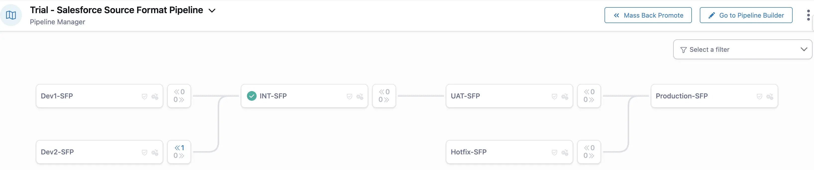

:::info
This article is part of a series covering third-party tools that can be used to implement DevOps practices and automate CI/CD in various projects. 
While these tools have both fans and critics, there is no perfect universal solution that suits every project. 
If you spot any mistakes or outdated information, please consider suggesting relevant edits, just like with any other article in this knowledge base. 
**Document Version:** 2025-06-28 
:::

**Copado** is a specialized tool for organizing DevOps processes on the Salesforce platform. It helps developers and administrators efficiently manage changes, automate Continuous Integration and Continuous Delivery (CI/CD) processes, implement infrastructure as code, and monitor and control releases and environments.

The tool is developed by **Copado Solutions**, a company focused on solutions within the Salesforce ecosystem. It is supported by an active community and an official development team that regularly updates the product to ensure compatibility with the latest Salesforce versions.

The primary goal of Copado is to provide a comprehensive solution for companies, including tools for pipeline creation, git management, environment and code quality control, testing, data and metadata migration, manual changes, and more.

Pipeline visualization with its configuration (an example of one of the basic templates):

# Core Features
**Main Functionality:**
- Management of Salesforce source code and metadata.
- Release automation (Pipeline Management).
- Git-based version control (with a dedicated [Copado Branch Strategy](https://docs.copado.com/articles/#!copado-ci-cd-publication/copado-branching-strategy)), portal article <!-- TODO: check link -->
[Copado Branching Strategy](docs/02_Practices_and_Processes/02_02_Git/02_02_04_Org_Branch_Copado.md)
- Integration with Jira, GitHub, Bitbucket, Azure DevOps, and more.
- Testing (Apex, Selenium, scripts).
- Reporting, auditing, and compliance management.
- Environment and permissions management.

**Architecture:**
- **Delivery Format**:  
  Copado is installed as a **managed package** in one of the Salesforce orgs, through which it manages releases, pipelines, and environments. It operates within the Salesforce UI and utilizes the platform's native access and security mechanisms.

- **Infrastructure**:  
  The core logic is hosted in Salesforce, while additional functions (e.g., automated testing, AI optimization, analytics) are offered as **cloud services** by Copado.

- **Licensing**:  
  Copado uses a **user- and environment-based licensing model**. The number of connected orgs, users, and feature access depends on the subscription level.

# Comparative Characteristics
The following parameters are used to assess all third-party tools reviewed on this portal.  
For a comparison of tools, see the summary article on third-party tools. [Comparison of Tools](./02_10_Third-party_Solutions/02_10_01_Comparison_of_Tools.md)
<!-- TODO: check link -->

## Deployment & CI/CD
### Source of Truth
Copado uses Git as the source of truth for deployment and version control. However, in large projects, teams may face scenarios where they are forced to create a new release branch by retrieving metadata from a target environment (e.g., Preprod or UAT). In such cases, the "Git as the source of truth" principle is violated.

This typically happens when there are many concurrent user stories and metadata version conflicts arise due to Copado’s Git strategy. Problems especially occur when a large number of feature branches (user stories) are deployed simultaneously.
In such cases, creating a **promotion branch** becomes problematic. The promotion branch is built from the target branch and receives feature branches one by one via merges. This sequential merging can lead to numerous conflicts and significantly prolong the release process, particularly for projects with a high volume of changes.

As a result, the team might be forced to create a "release branch" by **retrieving metadata directly from an environment** (e.g., Preprod or UAT) for promotion purposes. While this approach breaks the Git source-of-truth principle, it may be necessary to move the release forward.
<!-- TODO: check link -->
[Copado Branching Strategy](docs/02_Practices_and_Processes/02_02_Git/02_02_04_Org_Branch_Copado.md)

### Deployment Reliability
High reliability can be achieved by following best practices and introducing testing environments like Preprod or UAT. The decrease in reliability is caused by the specifics of the Git strategy used, which tends to provoke conflicts and makes them difficult to resolve during large and long-running release processes.

### Deployment Velocity
Copado speeds up small, frequent releases with pipeline automation. However, large-scale projects with parallel releases may suffer from considerable slowdowns due to merge conflicts and misconfigured quality gates.

### Change Control Simplicity
Intuitive UI for managing changes: user stories can be created by retrieving from an environment, linked with Jira, and deployed via pipelines. Each story is stored in a separate branch.

### Tracking Manual Steps
Built-in features for tracking and executing manual steps make releases with manual actions transparent and traceable. Scripts can also be automated.

### Destructive Changes
Natively supported. Copado enables tracking and execution of destructive changes.

### Merge Conflict Resolution Simplicity
Copado offers a UI for resolving conflicts, but it's not always convenient. Manual Git intervention might be required, which is challenging for beginners. Conflict resolution relies on a branching strategy that may not align well with actual dev changes.

A useful but risky feature is Copado's ability to remember conflict resolutions and auto-apply them, which may result in incorrect merges.

### Diff Comparison Visibility
To compare metadata changes planned for deployment between the source branch (in Copado, this is typically the user story branch or a promotion branch) and the target branch (usually corresponding to the destination environment), the standard functionality of the Git provider is used — for example, a pull request in GitHub.

### Rollback Capability
Rollback is available, with options to preview and selectively revert metadata after deployment.

### Deployment Notifications
Built-in notifications (email, Slack integrations) provide visibility into CI/CD processes.

### Deployment Status Monitoring
Copado provides a convenient monitoring dashboard that displays the current status of each stage of the CI/CD process, allowing teams to quickly respond to issues.

It includes a visual pipeline interface that clearly shows the state of each step, including errors and manual actions. The visualization is especially helpful when managing a high number of concurrent releases.

It also clearly highlights differences in the presence of user stories across environments, making it easier to track what has or hasn’t been promoted.

## Static Code Analysis (SCA)
### Integration with Popular SCA tools (PMD, CodeScan, SonarQube)
[Documentation link](https://docs.copado.com/articles/#!copado-ci-cd-publication/static-code-analysis-overview)

Copado supports:
* **PMD** — built-in integration (configurable within the pipeline). Copado enables the creation of custom rules and the management of their prioritization.
* **CodeScan** — supported via external runs and result integration.
* **SonarQube** — integration via API or external CI tasks.

## Usability
### UX for Admins/Consultants
Copado offers an interface that is intuitive for non-code users and is especially convenient for administrators and consultants.
Working with the system does not require deep technical knowledge, thanks to its user-friendly UI and built-in release scenarios.
With predefined steps and templates, administrators can manage releases without deep understanding of Git or command-line tools.

### UX for Developers
Copado is less convenient for developers, especially those with experience using Salesforce DX.
It requires adjustment to the Salesforce-based interface, particularly for those accustomed to traditional CI/CD systems.
Developers are required to perform additional actions through the Copado UI, which differs significantly from working with Git and an IDE, and can be inconvenient for those accustomed to more streamlined developer workflows.

### Change Tracking & History
While Copado uses Git for version control, its fixed Git strategy limits flexibility. This may be acceptable for small projects but problematic for large teams with complex release cycles.

### Flexibility in CI/CD Pipeline Configuration
Excellent pipeline visualization and intuitive configuration via UI. Custom scripts, conditions, approvals, and quality gates are supported. Complex setups require solid platform knowledge.

### Mandatory Developer Interaction with UI
Copado often requires interaction through its UI, especially for resolving merge conflicts and performing manual steps. This can be seen as a drawback by advanced teams that prefer CLI-based workflows. There is no full headless support via CLI or API across the entire lifecycle, which limits DevOps automation.

## Parallel Development & Releases
### Synchronization of Parallel Releases
Copado supports parallel release streams. Synchronization is possible via built-in **back-promotion**. This is sufficient for small projects but may cause issues in large projects due to limited Git/release strategy flexibility.

### Ease of Back Promotion/Merges
Handles standard release strategies (e.g., major/minor) well using back-promotion. However, experience with Git is highly recommended.

## Process & Integrations
### Ease of Version Control Integration
Copado provides high-quality integration with popular Git platforms such as GitHub, GitLab, and Bitbucket. The setup is straightforward and reliable.

### Integration with Jira and other ALM tools
Native integration with **Jira** ([Jira Integration Setup](https://docs.copado.com/articles/#!copado-ci-cd-publication/jira-integration-setup)) allows user story linking and status updates. Other ALM tools may also be integrated, case-by-case.

### Deployment KPI Monitoring & Reporting
Copado provides built-in DevOps KPI and release reports ([Copado Analytics Reports](https://docs.copado.com/articles/#!copado-ci-cd-publication/copado-analytics-reports)), with rich visualization features thanks to Salesforce's reporting tools.

### Salesforce Org Change Monitoring
Supports **Org Comparison** ([Org Differences Overview](https://docs.copado.com/articles/#!copado-ci-cd-publication/org-differences-overview)), audit trails, and deployment tracking.

### Org and Data Backup Solutions
Supports metadata snapshots for Git-based backups ([Rollback Based on Snapshots Differences](https://docs.copado.com/articles/#!copado-ci-cd-publication/rollback)). For data backups, Copado partners with [Own](https://www.owndata.com/resources/data-sheet/ownbackup-and-copado-overview).

## Implementation & Pricing
### Ease of Implementation & Onboarding
Can be implemented relatively quickly (a few weeks to 1–2 months). Good knowledge base and training materials. [Copado Academy](https://success.copado.com/) is a valuable resource that includes training materials and offers the ability to set up dedicated training orgs and pipelines for hands-on learning and practice.

### Licensing Model & Limitations
* Licensed **per user and org**.
* Some modules (e.g., [Low-Code Test Automation](https://www.copado.com/product-overview/copado-robotic-testing)) are sold separately.
* Possible **extra costs** for integrations, training, and support.
* **No free version**, trial available upon request.

# Key Advantages and Disadvantages
## Advantages
- Built-in templates and best practices for faster DevOps adoption.
- Turnkey Git strategy.
- Intuitive UI for admins, integrated within Salesforce.
- Visual pipelines with quality control steps.
- Clear dashboards and reports.
- Broad feature set.
- No advanced technical skills required.
- Active user community, regular webinars, and training.
- Copado Academy with certification system.

## Disadvantages    
- Developers must interact with the UI; Git + IDE-only workflows are not supported.
- The Git strategy is fixed and cannot be adapted to trunk-based development or Git Flow without significant compromises.
- Limited CI/CD tool choices.
- Relatively high licensing cost, especially for small teams. Advanced features like AI and test automation sold separately.

# Conclusion
Copado is a strong fit for small to medium-sized projects - particularly when the team is admin-heavy rather than developer-driven. It works well for short, frequent release cycles. 

Thanks to excellent training resources, Salesforce-native integration, and a vibrant community, Copado can be adopted relatively quickly. It enables teams to build CI/CD processes without programming skills.

However, this functionality comes at a cost: a fixed Git strategy that cannot be adapted without compromises, a need for deep understanding of the platform’s capabilities, and a significant number of manual UI steps required from developers. Projects may become dependent on Copado’s tooling and architecture, which can pose challenges when migrating to other platforms or building custom pipelines.

# Resources
Documentation: [link](https://docs.copado.com/)  
Salesforce Trailhead: [link](https://trailhead.salesforce.com/content/learn/modules/salesforce-devops-with-copado)  
Copado Community and Academy: [link](https://success.copado.com/)
YouTube: [link](https://youtube.com/@copado7902?si=b6lqmfNOXhk-1Uar)
