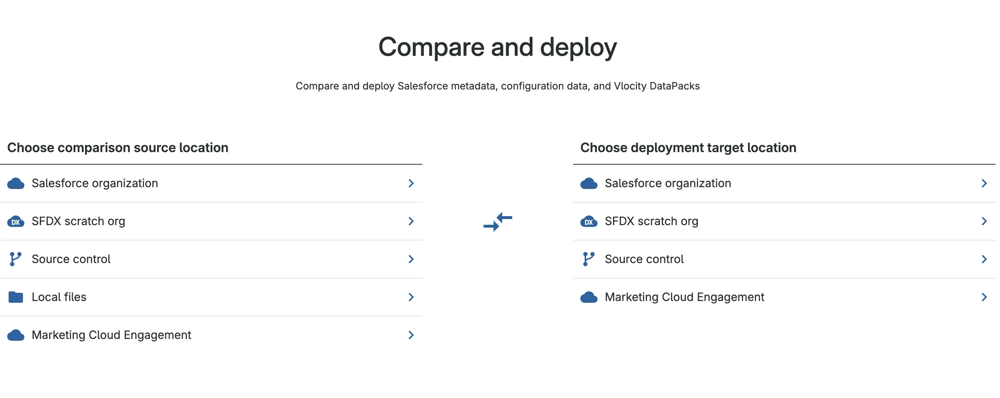
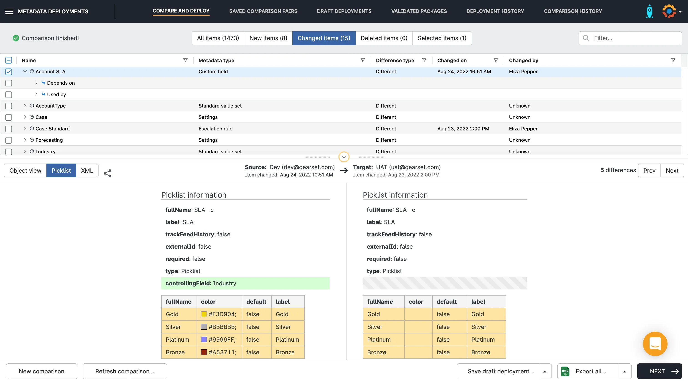

:::info
This article is part of a series covering third-party tools that can be used to implement DevOps practices and automate CI/CD in various projects. 
While these tools have both fans and critics, there is no perfect universal solution that suits every project. 
If you spot any mistakes or outdated information, please consider suggesting relevant edits, just like with any other article in this knowledge base. 
**Document Version:** 2025-11-16
:::

**Gearset** is a cloud-based DevOps platform purpose-built for Salesforce. It provides an intuitive UI and advanced automation for deployments, environment management, source control, CI/CD pipeline orchestration, and backups. Gearset helps track changes, enforce best practices, and deliver faster and safer releases with significantly reduced risks.

The platform delivers true flexibility to support both small and large initiatives — suitable for developers as well as Salesforce admins with no Git or coding background. Flexible Git workflows make it possible to implement Git and release strategies tailored to the actual needs of a project.

The wide functional coverage meets the requirements of the vast majority of Salesforce projects. Their free learning portal is highly recommended for people responsible for establishing and driving DevOps practices on Salesforce projects, regardless of the technology stack chosen on the project:  
[https://devopslaunchpad.com/](https://devopslaunchpad.com/)

[Gearset](https://gearset.com/) is developed by **Gearset Ltd**. The product is actively maintained and continuously enhanced — new capabilities are shipped frequently and the platform rapidly adapts to Salesforce changes. Gearset also has an active user community.

# Core Features
**Main Functionality**
- Comparison and deployment of metadata across different sources (org, Git, etc.).    
- Creating CI jobs for scheduled deployments/validations or event-based triggers.    
- Ability to get detailed deployment insights, including metrics.    
- CI/CD pipelines with visual configuration and trigger logic.    
- Integration with version control systems (GitHub, GitLab, Bitbucket, Azure DevOps).    
- Change monitoring with automatic notifications, including Slack and Microsoft Teams.    
- Built-in static code analysis using PMD and custom rules.    
- Jira integration for story tracking and work management.    
- Support for testing (Apex tests).    
- Backup and restore capabilities for both metadata and data.

**Architecture**
- **Delivery Format**:  
    SaaS solution, no package installation required in Salesforce orgs. Management is performed through the Gearset web interface.

- **Infrastructure**:  
    Gearset connects to Salesforce orgs and version control systems via secure OAuth. All processing runs in Gearset’s infrastructure.

- **Licensing**:  
    Gearset uses a **per-user licensing model**, with tiered plans (Deploy, Teams, Enterprise). Additional functionality, such as data backup, is licensed separately. A 30-day free trial is available.

Selecting Source and Target for Comparison:

# Comparative Characteristics
The following parameters are used to assess all third-party tools reviewed on this portal.
For a comparison of tools, see the summary article on third-party tools. [Comparison of Tools](./02_10_Third-party_Solutions/02_10_01_Comparison_of_Tools.md)
<!-- TODO: check link -->

## Deployment & CI/CD
### Source of Truth
Gearset enables projects to follow the **“Git as a single source of truth”** principle and to adopt best practices for source-driven development. Teams can apply any branching strategy based on project requirements. The strategy can also be flexibly adjusted later as business and project needs evolve.
<!-- TODO: check link to docs/02_Practices_and_Processes/02_02_Git -->
[Git strategies](docs/02_Practices_and_Processes/02_02_Git/02_02_01_Strategies.md)

In addition to standalone tooling and automations, Gearset provides a ready-to-use approach for promoting changes — Pipelines.
[Gearset Pipelines](https://docs.gearset.com/en/articles/6115277-an-introduction-to-gearset-pipelines) is a visual release management tool for driving Salesforce changes through Git. It shows all environments and branches as stages and lets you promote changes between them. On each promotion Gearset creates a **promotion branch** — a temporary branch containing the delta between the current and target stage. From this branch Gearset automatically opens a pull request into the next stage target branch. This enables safer testing and change control before merging. As a result, CI/CD becomes easier to set up and release risk is reduced significantly — this tool allows projects to configure CI/CD pipelines quickly and easily.

### Deployment Reliability
Every deployment or validation in Gearset is based on a metadata comparison between the source (Git) and the target org. Gearset enables users to review changes, identify conflicts, and analyze dependencies before executing a deployment — surfacing potential issues early. If needed, a rollback deployment can be generated to return the environment to a previous stable state, improving reliability and release control.

### Deployment Velocity
With flexible metadata filters and the ability to deploy **only delta changes**, Gearset often accelerates delivery and reduces pipeline load. This makes Gearset highly scalable for complex projects and larger teams. However, despite high deployment performance, the mandatory metadata comparison step remains unavoidable — and can slow both delta deployments and full releases when large change volumes are involved.

### Change Control Simplicity
Change control through the Gearset UI is intuitive. Gearset allows users to easily create feature branches (with customizable naming templates) and retrieve required metadata directly into them — greatly simplifying work for admins. Gearset is also convenient for developers who prefer working through IDEs since it can be easily aligned with any required CI/CD and Git process strategy. Changes can be linked to Git commits and Jira tickets, improving transparency of delivery.

### Tracking Manual Steps
Gearset supports manual steps with execution tracking.
[Gearset doc](https://docs.gearset.com/en/articles/9859659-pre-and-post-deployment-steps-in-gearset-pipelines)

### Destructive Changes
Gearset supports destructive deployments with dependency analysis and preview.

### Merge Conflict Resolution Simplicity
Gearset can automatically resolve simple conflicts using its own built-in algorithm. More complex conflicts can be handled through a visual UI version selector. Gearset uses its own comparison and merge logic optimized for Salesforce metadata structure — reducing the number of false conflicts that occur with standard Git.

### Diff Comparison Visibility
Gearset provides side-by-side diffs directly in the UI. For many component types such as Page Layouts, Profiles, Permission Sets — changes are presented as structured setting diffs instead of raw XML. This dramatically simplifies review and helps quickly understand what fields, sections, or permissions changed — even for people not familiar with XML. Diffs can also be reviewed via Git provider UIs (GitHub, GitLab, Bitbucket) within pull request reviews, which is convenient for collaborative approval processes. 
An example from the Gearset website: 

### Rollback Capability
Gearset allows metadata rollback using automatic org snapshots taken before each deployment — significantly increasing pipeline safety including production releases. Selective restoration of particular metadata components is supported, enabling rollback only for required changes. Before rollback, metadata can be compared against the snapshot (similar to deployment comparison).

### Deployment Notifications
Notifications are supported through popular corporate messaging channels such as email, Microsoft Teams, Slack, and webhooks.

### Deployment Status Monitoring
Gearset offers an informative monitoring dashboard that displays deployment status in real time across pipeline stages, including errors, warnings, and change history. Detailed information is available for each step.

## Static Code Analysis (SCA)
### Integration with Popular SCA tools (PMD, CodeScan, SonarQube)
Gearset provides built-in static code analysis based on **PMD** out of the box. However, rule violations are classified only as **Error** or **Warning**, without intermediate levels (unlike PMD). Custom rules can also be defined. Native integrations with SonarQube or CodeScan are not available — but they can be added through external CI tools within the pipeline.

## Usability
### UX for Admins/Consultants
Thanks to a well-designed web interface, Gearset is convenient for administrators and consultants.
Predefined feature branch naming templates and pipeline templates help quickly adapt delivery processes to the needs of a specific project.
All actions are performed through an intuitive UI designed specifically for Salesforce DevOps tasks.
Retrieval, deployment, and comparison flows are implemented in just a few clicks — making the tool accessible even for specialists without a technical background.

### UX for Developers
Gearset does not enforce strict limitations on Git workflow strategy and does not require the web interface to be used if automation is set up correctly.
Developers can continue working in their preferred IDE and interact with Gearset purely through Git processes — without using the UI — if CI/CD is fully automated.

### Change Tracking & History
Gearset stores the full change history in Git, making it possible to track every change to code and metadata.
On each deployment, an automatic snapshot of the target environment is created — enabling rollback without complex manual steps.
Each deployment record contains a list of modified files and the full deployment package, making audit and restoration easier.

### Flexibility in CI/CD Pipeline Configuration
Pipelines in Gearset are configured visually through the UI, and CI jobs can be triggered by Git events (push, pull request), on a schedule, or manually.
Custom scripts, conditional logic, manual approvals, and **quality gates** are supported.
Configuration is performed without editing YAML or other configuration files — simplifying setup for non-technical contributors.
Gearset provides extensive flexibility for customizing CI/CD processes.

### Mandatory Developer Interaction with UI
Some tasks — for example automation configuration — require mandatory use of the UI.
For complex releases, manual comparison steps may also be required before deployment.
Headless operation is limited: it is not possible to eliminate UI usage entirely, although a significant portion of activities can be automated through Git and external integrations.

## Parallel Development & Releases
### Synchronization of Parallel Releases
Gearset supports parallel release streams. Flexible CI/CD automation configuration and the absence of a rigid Git strategy requirement allow teams to implement a delivery model aligned with business needs.
Synchronization between branches is implemented via the built-in **back-promotion** mechanism with a visual interface that lets users review differences and select the required changes.
The process is executed in just a few clicks and is integrated with Git, simplifying the flow of changes from production back into release or development branches.

### Ease of Back Promotion/Merges
Gearset automates back-promotion and tracks which changes have already been propagated.
Simple conflicts can be automatically merged, while complex cases can be resolved via a UI with preview and selective application of changes.
Back-promotion synchronization can be integrated into pipelines to minimize manual effort and keep all development branches current and aligned.
[Org syncing with Pipelines | Gearset Help Center](https://docs.gearset.com/en/articles/9773388-org-syncing-with-pipelines)

## Process & Integrations
[Article with the current list of supported integrations](https://docs.gearset.com/en/articles/3741573-gearset-supported-software-integrations)
### Ease of Version Control Integration
Gearset provides fast and simple integration with major Git platforms: **GitHub**, **GitLab**, **Bitbucket**, **Azure DevOps**, **AWS CodeCommit**.
Integration is configured through the UI and supports both OAuth authentication and personal access tokens.
Gearset also allows connecting other git-based VCS platforms and working with multiple repositories and branches simultaneously.

### Integration with Jira and other ALM tools
Native integration with [Jira](https://docs.gearset.com/en/articles/1384669-integrating-with-jira-hosted-cloud) enables automatic linking of commits and deployments to work items, updating statuses, and posting comments directly from Gearset.
Integrations with other ALM systems are also supported, such as **Azure DevOps**, **Asana**, **Slack**, **Microsoft Teams**, and others.

### Deployment KPI Monitoring & Reporting
Gearset provides built-in [dashboards and reports](https://docs.gearset.com/en/articles/625054-metadata-deployment-history) showing deployment statuses, error counts, execution time, and other key metrics.
A separate module — [Measuring your DevOps performance](https://docs.gearset.com/en/articles/11560575-measuring-your-devops-performance) — collects and visualizes DevOps efficiency metrics to track progress and identify bottlenecks.

### Salesforce Org Change Monitoring
Gearset enables change monitoring in Salesforce orgs with automatic metadata snapshots: [Change monitoring](https://docs.gearset.com/en/articles/604536-change-monitoring-automating-org-change-tracking-and-metadata-backup).
Notifications and scheduled monitoring can be configured. Snapshots can be used for deployment, restoration, or code quality analysis.

### Org and Data Backup Solutions
Gearset supports automated backup of Salesforce metadata and data.
Metadata snapshots allow selective rollback. Data backup preserves object relationships and can be restored partially or fully: [Data backup](https://docs.gearset.com/en/collections/10435155-data-backup-and-archiving).

## Implementation & Pricing
### Ease of Implementation & Onboarding
Gearset can be rolled out very quickly — basic CI/CD and pipeline configuration takes minimal time.
Onboarding complexity depends on the role: DevOps/Release engineers will need time to explore the platform, while developers working only in IDEs and not participating in delivery may not need onboarding at all.

Training resources include [webinars and e-books](https://gearset.com/resources), trial orgs, and demo samples.
The [DevOps Launchpad](https://devopslaunchpad.com/) — a free learning platform — is worth highlighting separately, beneficial for both beginners and experienced engineers.

### Licensing Model & Limitations
Licensing follows a **per-user subscription model**, with cost depending on selected modules:
* Base plans include CI/CD and monitoring.
* Additional modules (such as **Data Backup**, **CPQ Deployment**, **Observability**) are purchased separately.
* Gearset provides a 30-day free trial.
* Detailed pricing information is available under [Pricing](https://gearset.com/pricing).

# Key Advantages and Disadvantages
## Advantages
- Fully SaaS — no installation required in Salesforce.
- Can be used as a standalone automation tool or as a complete platform for building CI/CD pipelines.
- Intuitive and user-friendly web interface for admins and consultants.
- Visual side-by-side metadata and settings comparison (layouts, profiles, etc.).
- Supports any Git strategy (trunk-based, Git Flow, feature branching).
- Fast implementation and minimal learning curve.
- Built-in process templates and DevOps best practices.
- Backup and restore (metadata and data).
- Detailed documentation, [DevOps Launchpad](https://devopslaunchpad.com/) and training resources for different roles.
- Compare-based deployment increases transparency and improves reliability of released changes.

## Disadvantages
- For advanced CI/CD scenarios, external tools such as **GitHub Actions, GitLab CI, or Jenkins** may be required.
- When rolling back **destructive changes**, additional control is required because restoration may not be complete.
- Compare-based deployment can slow down delivery — especially in orgs with large metadata volumes.

# Conclusion
**Gearset** fits well for projects ranging from small to large. Flexibility in automation level, release strategies, and Git workflows makes it suitable for diverse project types and scalable to various program sizes.

Thanks to its SaaS nature, thoughtful UI, templates, and high-quality training resources (including DevOps Launchpad), onboarding is fast. Developers can remain within familiar Git/IDE workflows, while admins handle delivery through the web interface. Built-in comparison and change control mechanisms increase transparency and release reliability.

However, several considerations should be taken into account: pipeline configuration and administration are done through the UI; the compare-and-deploy model adds overhead on large metadata estates; pricing depends on the modules selected (e.g., Backup).

# Resources
Official documentation: [link](https://docs.gearset.com/) 
Training: [link](https://devopslaunchpad.com/) 
YouTube: [link](https://youtube.com/@gearsethq?si=dcFGAPYQTiG_NtWK) 
Blog: [link](https://gearset.com/blog/)
